```{r setup-knitr, include=FALSE}
options(htmltools.dir.version = FALSE)
# knitr::opts_knit$set(root.dir='..')
knitr::opts_chunk$set(eval = TRUE, 
                      echo = FALSE, 
                      cache = FALSE,
                      include = TRUE,
                      collapse = FALSE,
                      message=FALSE,
                      warning=FALSE, 
                      dependson = NULL,
                      engine = "R", # Chunks will always have R code, unless noted
                      error = TRUE,
                      fig.path="Figures/",  # Set the figure options
                      fig.align = "center", 
                      #fig.width = 7,
                      #fig.height = 7, 
                      fig.keep='all', fig.retina=3)

```

```{r setup-library}
library(tidyverse)
library(MASS)
library(reshape2)
library(plyr)
library(tidyverse)
library(lubridate)
library(readxl)
library(tidyselect)
library(tidystats)
library(glue)
library(here)
library(gt)
library(gtsummary)
library(kableExtra)

```


# `r emo::ji("wave")` Hello

### me: **Boncho Ku**

- **Statistician**, _Korea Institute of Oriental Medicine_
    + github: **@zorba78**
    + email: **secondmoon@kiom.re.kr**

- **Team**: Clinical Research Coordinating Team    


### Current Works in KIOM

.pull-left[
#### **Data Science**
- Statistical learning model
- Text mining
- Data linkage/statistical matching
- Data management
]


.pull-right[
#### **Biostatistics**
- Experiment & study design: RCT and observational study 
- Sample size calculation
- Statistical consulting and lecturing
]


### Slides: **https://zorba78.github.io/ust-medical-statistics**


???

_Hello everyone. I'm Dr. Boncho Ku and I'm gonna give you several lectures related to statistics._

_ I assume that you guys are somewhat confused because Dr. Lee does not come up to the class._ 

_ Instead, someone not shown in the syllabus talks about statistics._ 

---
class: inverse, center, middle

# Objective & Motivation


---

#  Overview 

## `r icons::fontawesome("info-circle", style = "solid")` Famous quotes about statistics

.left[
.left-column[
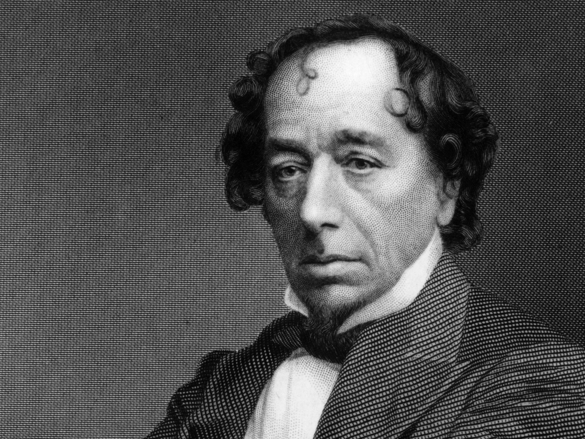
]

.right-column[
> _There are three types of lies: lies, damn lies, and **STATISTICS**_.
>
> Benjamin Disraelli

]]


.left[
.left-column[
<br/>

]

.right-column[
> _Fact are stubborn things, but **STATISTICS** are pliable_.
>
> Mark Twain

]]


.left[<br/><br/><br/><br/><br/><br/><br/><br/><br/><br/>**and so on...**]


.left[### Numerous quotes about statistics negatively express the statistics themselves]

$\rightarrow$ **Mostly hard to refute** `r emo::ji("tear")`


---
class: inverse, center, middle

# Are you sure? `r emo::ji("surprise")`


---

# Many people are

#### Saying Statistics as 

--
.center[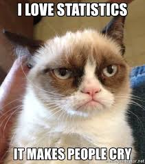 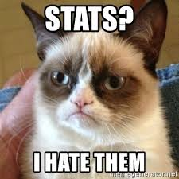 
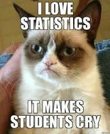 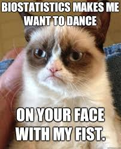]

--
.center[#### However, statistics based on adequate **DATA** always provide useful information and allow us to maintain an objective view of a particular phenomenon.]


--
.center[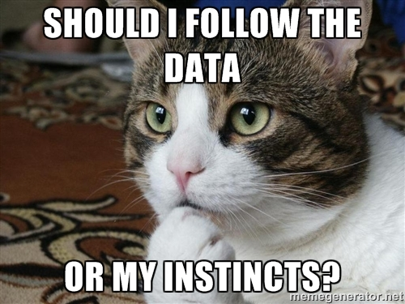]


---
class: inverse, center, middle

# What is Statistics? `r emo::ji("pin")`
---

# Definition

### So then, **what is STATISTICS?**

--
> #### Statistics is concerned with scientific methods for **collecting**, **organizing**, **summarizing**, **presenting** and **analyzing** DATA


--
### **Why STATISTICS?**

--
> #### To draw **valid conclusions** and **making reasonable decisions** based on analyzing **DATA**


--
.center[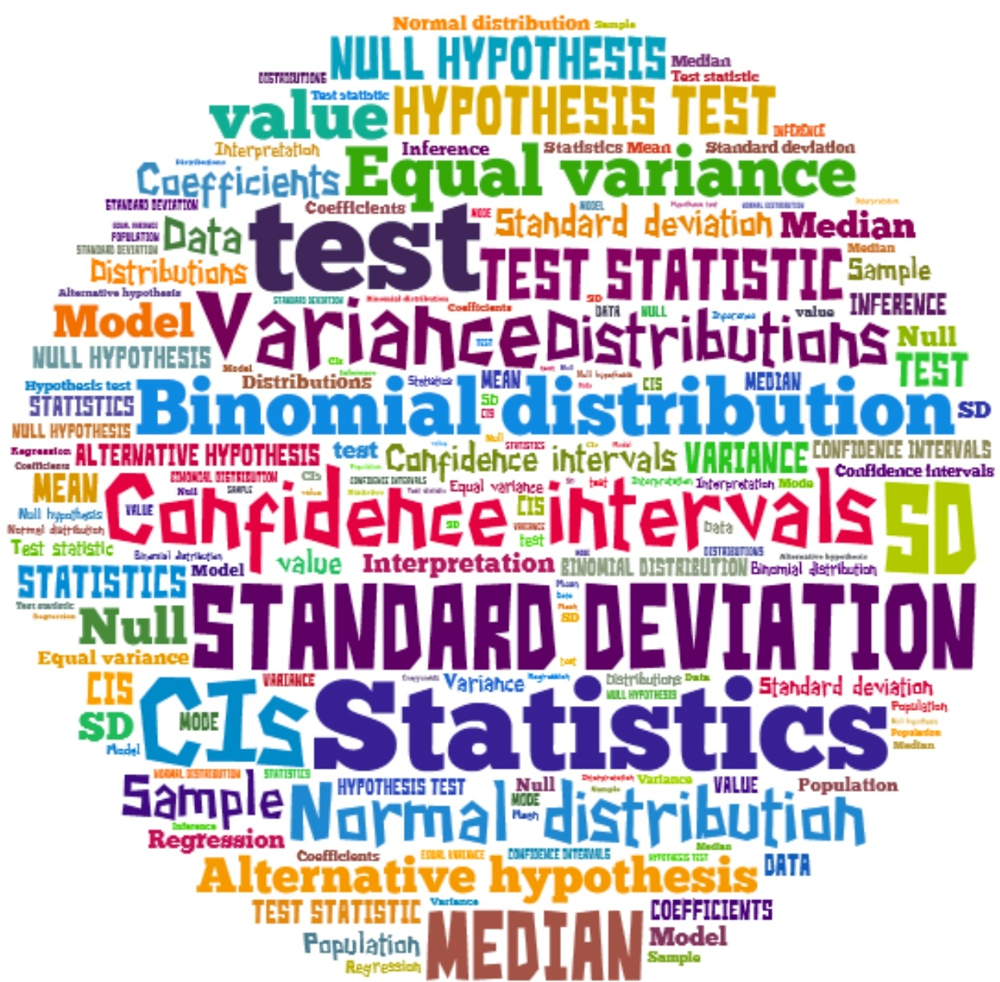 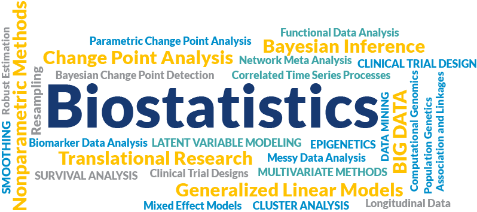]
.center[Each wordcloud was cited from [Trident University International](http://blog.trident.edu/-temporary-slug-8756cc7e-1d1b-458e-94e2-3ff603f80c9e) and
[Augusta University](http://www.augusta.edu/mcg/dphs/biostats/research/index.php)]

---
class: inverse, center, middle

# Statistics in Medical Research


---
# In the field of Medicine

### Medical Statistics (a.k.a Biostatistics)

> **Applications of STATISTICS** to medicine and the health sciences including epidemiology, public health, forensic medicine, and clinical research


--
### Is it Necessary?

--

.center[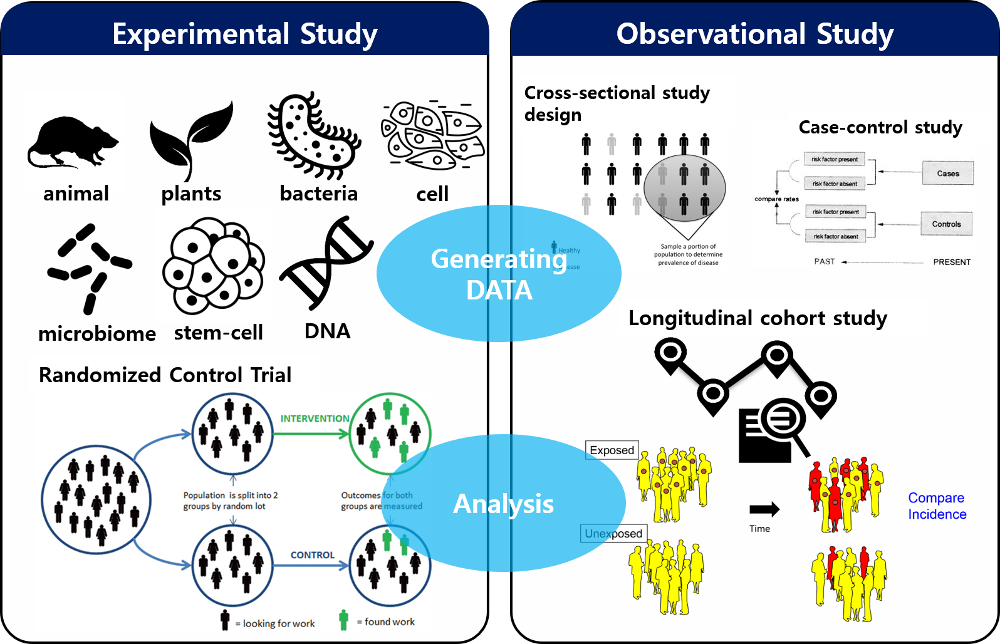]


---
class: inverse, center, middle

# Important Things in Statistics `r icons::fontawesome("exclamation-circle", style = "solid")`

---

# `r icons::fontawesome("table", style = "solid")` Data 

### Characteristics or information collected through observation 

--

> - Observation
>   - Investigation (or survey)
>   - Experiment
> - Usually numeric values (or text that are quantified)
> - Object of quantitative (statistical) analysis 
> - Source of knowledge

--

### Technically, Data can be defined as 

--

> - A set of values of **qualitative** or **quantitative** **VARIABLES**

--

#### In Sum, Data are **measured**, **collected**, and **analyzed**


.center[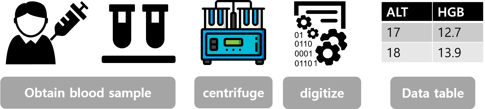]

---

# `r icons::fontawesome("border-all", style = "solid")` Summarization, `r icons::fontawesome("chart-pie", style = "solid")` Visualization 

### Data themselves are just a bunch of numbers 

.pull-left[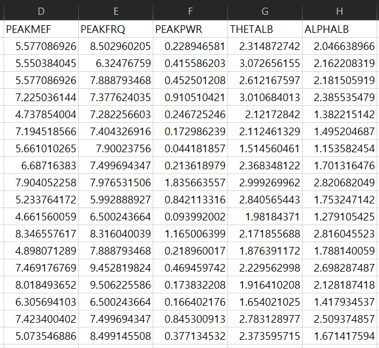]

.right[
## `r icons::fontawesome("arrow-right", style = "solid")` So What???


#### $\rightarrow$ Extract meaningful information from data?


#### &nbsp;&nbsp; - Table: based on descriptive statistics

#### &nbsp;&nbsp; - Chart (plot): shape or pattern of data

]

<br/>

.center[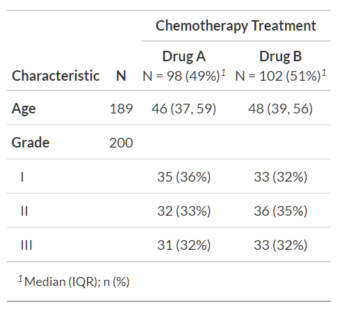 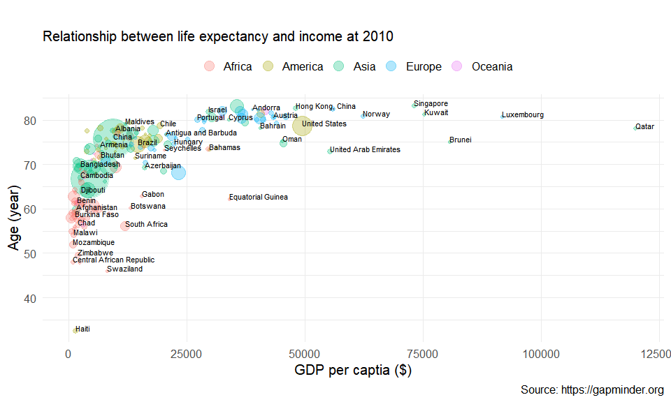 
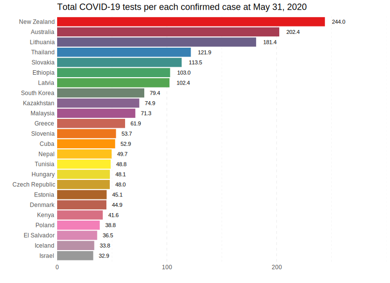]


.center[Examples of table and plots: based on descriptive statistics (mean, proportion, ...)]


<!-- ??? -->

<!-- _if not asked to lend money_. -->

---

# `r icons::fontawesome("lightbulb", style = "solid")` Inference 

## Two main phase in any statistical analysis 

> - **Exploratory data analysis**: analyzing data to summarize their main characteristics


> - **Statistical inference**: a set of procedures used in making appropriate conclusions and 
generalizations about a whole (**the population**), based on a limited mumber of observation (**the sample**)
>    - Generalization $\rightarrow$ **the probability distribution**


## Two important terminologies in statistical inference

> - **Population**: the totality of individual observations for the inference

> - **Sample**: a subset of the population or the part of population that we actually examine to gather information $\rightarrow$ expressed as **DATA** 


---

# Why Sample?? `r emo::ji("meh")`

### Measure everything from POPULATION

- You will get exactly correct answer
- No need to meet a weirdo statistician LIKE ME
- Possible only if you had a plenty of 
    - Money (typing "**SHOW ME THE MONEY**" may help your budget)
    - Time (**TOO SHORT TO COLLECT** all of entire population)
    
### Inferential approach based on SAMPLE

`r icons::fontawesome("arrow-right", style = "solid")` If we have a proper sample that represents the whole population, you can get NEARLY the correct answer

### Benefits of Sampling
  
> - **Cost**: save the money and time
> - **Utility**: destroying sampling (e.g. examine the life of bulbs)
> - **Accessibility**: impossible to examine a whole population


???


_One can undertake exploratory data analysis without progressing to inference. 
Conversely, in practice any inferential process should always be preceded by 
an exploration of the data in order to understand the data more fully._


---
class: inverse, center, middle

# Parameters and Estimates


---


# Parameters `r icons::fontawesome("bible", style = "solid")`

### Parameters exist somewhere in the universe 

> - $\rightarrow$ the **TRUE VALUE** for representing the target population 
> - $\rightarrow$ **NO ERROR**
> - Usually notated with Greek letters (e.g. $\mu, \sigma, \theta, \psi$, ...)


### From the view of _frequentists_, 

> - Parameters are fixed $\rightarrow$ never changing
> - Parameters exists but we never know the true value of them
> - But we can "guess" them from sample


### In Sum, parameters are 

> - any measured quantity of a population $\rightarrow$ **describe the population**
> - usually infered from the **calculated statistics** $\rightarrow$ from the particular sample of **DATA**


---


# Sample Statistics $\sum$

### Estimating parameters 

> - calculating **SAMPLE STATISTICS** (a.k.a. **estimator of the population parameter**)
> - **SAMPLE STATISTICS** varied from **different samples of data** $\rightarrow$ inevitably involves **ERROR** $\rightarrow$ **HAVE DISTRIBUTION**
> - A sample statistic should never to be quoted without some estimate of its variation
> - **standard error (SE)** of the sample statistic


$$
\mathrm{SE} = \frac{\hat\sigma}{\sqrt{N}}
$$


### How good is our estimate? $\rightarrow$ less error (variation) and how closer to the true parameter


### _Measurement is ubiquitous_ $=$ _Errors are ubiquitous_

---

# Estimation & Hypothesis Testing `r icons::fontawesome("cloud", style = "solid")`

### Two basic branches of statistical inference

> - **Estimation**
> - **Hypothesis test**

#### Both make use of statistics calculated from sample data

#### The choise of which to use depends on the question

> - What is the value of something? $\rightarrow$ estimation
> 
>  Versus.
>
> - Are two things the same? $\rightarrow$ hypothesis testing


The basic principle of estimation & hypothesis are the same for **ALL** types of parameters and statistics 
but the details may change. 

- test statistics 
- standard error
- probability distribution

---

# Scheme of Statistical Inference

<br/><br/>

.center[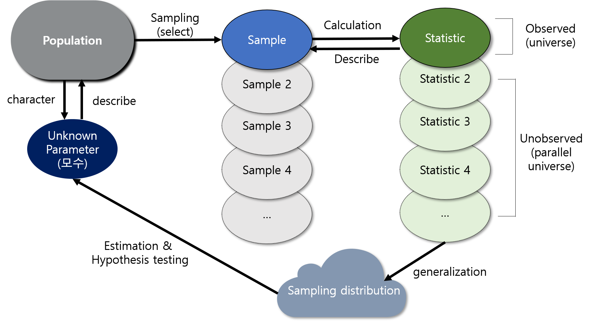]

.center[##### Schematic relationship between population, sample, statistic, and sampling distribution]

---
class: inverse, center, middle


# We Deal All things VERY SHALLOWLY `r emo::ji("wink")`


---

class: inverse, center, middle

# Course Description


---
# `r emo::ji("calendar")` Lecture Schedule

```{r}
input <- ("Week 1 (2021.03.04): Introduction
Week 2 (2021.03.11): Terminologies and descriptive statistics 
Week 3 (2021.03.18): Probability, expectation, and Important probability distributions
Week 4 (2021.03.25): Random variables, sampling distribution and central limit theorem
Week 5 (2021.04.01): Estimation and hypothesis testing
Week 6 (2021.04.08): Analysis of continuous data (part 1)
Week 7 (2021.04.15): Analysis of continuous data (part 2)
Week 8 (2021.04.22): Analysis of categorical data
Week 9 (2021.04.29): More applications (sample size calculation, regression analysis)")
course_desc <- read.table(textConnection(input), sep = ":", header = FALSE)
course_desc$V3 <- c(rep("Dr. Boncho Ku", each = 5), rep("Dr. Mimi Ko", each = 4))
names(course_desc) <- c("Week", "Description", "Lecturer")
kbl(course_desc, 
    booktabs = TRUE, 
    caption = "Course Schedule (Week 1 ~ Week 9)") %>% 
  kable_paper %>% 
  kable_styling(bootstrap_options = c("hover"))

```

### By Dr. Ku and Dr. Ko. 


---

# **Yourselves!!**

## To Enhance Your Statistical Mind


- [Introduction to Statistical Methodology](https://bookdown.org/dereksonderegger/570/)

- [1014SCG Statistics - Lecture Notes](https://bookdown.org/mcbroom_j/Book/)

- [StatQuest](https://www.youtube.com/channel/UCtYLUTtgS3k1Fg4y5tAhLbw)


---
class: inverse, center, middle

# Question? 


