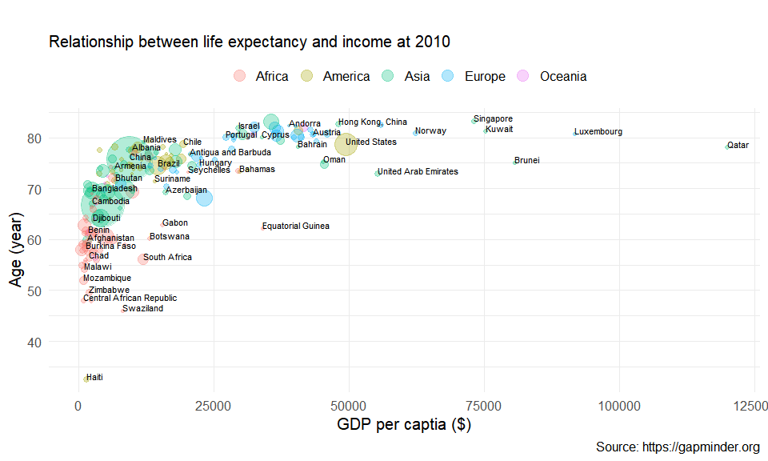

```{r setup-knitr, include=FALSE}
options(htmltools.dir.version = FALSE)
# knitr::opts_knit$set(root.dir='..')
knitr::opts_chunk$set(eval = TRUE, 
                      echo = FALSE, 
                      cache = FALSE,
                      include = TRUE,
                      collapse = FALSE,
                      message=FALSE,
                      warning=FALSE, 
                      dependson = NULL,
                      engine = "R", # Chunks will always have R code, unless noted
                      error = TRUE,
                      fig.path="Figures/",  # Set the figure options
                      fig.align = "center", 
                      #fig.width = 7,
                      #fig.height = 7, 
                      fig.keep='all', fig.retina=3)

```

```{r setup-library}
library(MASS)
library(reshape2)
library(plyr)
library(tidyverse)
library(lubridate)
library(readxl)
library(tidyselect)
library(tidystats)
library(glue)
library(here)
library(gt)
library(gtsummary)
library(kableExtra)

```


class: inverse, center, middle

# Important Terminologies `r emo::ji("book")`

---

# Two types of statistical analysis

> - **Exploratory data analysis**: analyzing data to summarize their main characteristics $\rightarrow$ classical term: **descriptive statistics**


.center[  
]


> - **Statistical inference**:  a set of procedures used in making appropriate conclusions and 
generalizations about a whole (**the population**), based on a limited mumber of observation (**the sample**)


.center[]


---
# Parameters `r icons::fontawesome("bible", style = "solid")`

### Parameters exist somewhere in the universe 

> - $\rightarrow$ the **TRUE VALUE** for representing the target population 
> - $\rightarrow$ **NO ERROR**
> - Usually notated with Greek letters (e.g. $\mu, \sigma, \theta, \psi$, ...)


### From the view of _frequentists_, 

> - Parameters are fixed $\rightarrow$ never changing
> - Parameters exists but we never know the true value of them
> - But we can "guess" them from sample


### In Sum, parameters are 

> - any measured quantity of a population $\rightarrow$ **describe the population**
> - usually infered from the **calculated statistics** $\rightarrow$ from the particular sample of **DATA**


---
# What is in the data? 

### Individuals

> - **The objects described by data: not necessarily to be people**
> - What individuals the data describe? people, guinea pig, household, text, shop, ...
> - How many individuals are in the data? $\rightarrow$ the size of sample (data)


### Variables

> - **A measurement made on an individual** $\rightarrow$ **a characteristic of an individual**
> - **Example 1**: A researcher examines people to obtain the prevalence of lung cancer 
>    - Gender, smoking and alcohol comsumption, height, weight, income, ...
> - **Example 2**: 100 trees from Gyeryong Mt. $\rightarrow$ species, height, circumference at chest height

---

# Types of Variables


```{r}
require(kableExtra)
type <- c("Norminal", 
          "Ordinal", 
          "Interval", 
          "Ratio")
example <- c("sex, marital status, blood type, race, eye colour, religion, ...", 
             "grade, education level, preference, severity, ...", 
             "temperature, IQ, SAT score, ...", 
             "distance, length, height, weight, BMI, blood pressure, ...")
operation <- c("counting", 
               "counting, ranking", 
               "counting, ranking, \\(+\\), \\(-\\)", 
               "counting, ranking, \\(+\\), \\(-\\), \\(\\times\\), \\(\\div\\)")
tab <- data.frame(type, example, operation)
names(tab) <- c("Type", "Example", "Operation")
kable(tab, 
      format = "html", 
      align = "lll", 
      escape = "FALSE", 
      booktabs = TRUE, 
      caption = "Type of Variables") %>% 
  kable_styling(full_width = F) %>% 
  column_spec(1, bold = T, width = "10em") %>% 
  pack_rows("Qualitative variable", 
            1, 2, 
            label_row_css = "background-color: #666; color: #fff;") %>% 
  pack_rows("Quantitative variable", 
            3, 4, 
            label_row_css = "background-color: #666; color: #fff;")
```


---

# Random Variable 

### All variables in the data can be considered as random variables!!

> - **a variable whose value may changing depending on chance**
>    - Example 1: price of a game $\rightarrow$ tossing a coin 
>    - (head: + ￦1000, tail: - ￦1500)
> - symbolized by an upper case letter: $X$, $Y$, $Z$, ... 
>   - $X$:  generally indicating **population**
>   - $X_1, X_2, X_3, \ldots$: indicating **sample**
> - A particular value of a random variable symbolized as a lower case letter: $x$, $y$, $z$, ...
>   - $x_1, x_2, x_3, \ldots$: indicating **observed values**


### We don't know what value comes from a variable!!


???

random variable is simply a number whose value is determined by the outcome of a chance process. 
The amount that the insurance company will pay out in the next year is an example of a random variable: 
its value depends on a complex chance process—how many homeowners experience a flood, how damaging each flood is, etc.


---
# Uncertainty, Error and Variability

### **Uncertainty**: lack of knowledge 

> - a sample $\rightarrow$ appropriately represent the population??
> - partially observable or stochastic (a.k.a probabilatic, statistical)


### **Error**: experimental and natural variability

> - repeating to measure the height for a person $\rightarrow$ always identical?
> - Exactly reproducible experiment $\rightarrow$ POSSIBLE??

### Error $\neq$ Uncertainty

> - Both exist to some extent in any scientific research
> - Both are related to **PROBABILITY!!**


???

Uncertainty refers to epistemic situations involving imperfect or unknown information. 
It applies to predictions of future events, to physical measurements that are already made, 
or to the unknown. Uncertainty arises in partially observable and/or stochastic environments, 
as well as due to ignorance, indolence, or both. 
It arises in any number of fields, including insurance, philosophy, physics, statistics, 
economics, finance, psychology, sociology, engineering, metrology, meteorology, ecology, 
and information science.


---
# Probability `r icons::fontawesome("dice", style = "solid")` 

### An crucial tool in statistics 

.center[]

> - tossing a coin $\rightarrow$  what chance of showing head? 
> - rolling a dice 
>   - what is the chance of getting 3? 
>   - what is the chance of getting odd numbers in the nex roll? 


### **Probability** 

> - a **random process** giving rise to an outcome 
> - the probability of outcome: **proportion** of times an outcome occur in infinte number of times $\rightarrow$ empricial probability


???


If $E$ is an event, then the probability that $E$ occurs is the long-term proportion of times that the event occurs, 
if we could repeat the random process many, many times.


---

# Probability `r icons::fontawesome("dice", style = "solid")`

###  Example: Coin toss

```{r setting, echo=FALSE}
library(scales)
```


```{r, echo=TRUE}
coin_flip <- function(faces, ntry = 10) {
  record <- sample(faces, size = ntry, replace = TRUE)
  prob1 <- sum(record == faces[1])/ntry
  prob1
} # a function to simulate tossing a coin
x <- numeric(1000) # a space for results
set.seed(12345) # fix the random sequences
coin <- c("H", "T")
# repeat 1000 times
for (i in 1:1000) x[i] <- coin_flip(coin, i)

```

.center[]

---

# Probability Distribution 


#### A random variable alway have a specific distribution depending on the structure of the probability


#### - Specific structure $\rightarrow$ **probability distribution**

> - a mathematical function that gives the probabilities of occurrence of different possible outcomes (a.k.a. random variable) for an experiment

#### Example 

> Let the oucome of a coin toss (experiment) denote $X$
> - $X = x_1$ (head) $\rightarrow$ 0.5
> - $X = x_2$ (tail) $\rightarrow$ 0.5


.center[]


???

## A probability distribution have a role to Assign a probability to the observed outcome 

---
# Expectation 

### Suppose Chicago Bulls in the NBA Tournament

> - In long term, how many times Chicago Bulls get into the tournament? 
> - How many times the head occurs when tossing a coin repeatedly many many times in average?
> - How much money can you expect when playing roulette at a casino for many many times?
> - $\rightarrow$ a concept of **Average!!**


### Imagine the number of trial (process) becomes $\infty$


### Expected value

> - the number that this average converges to
> - Often called as **mean** of a random variable $X$
> - denoted as $\mu_X$ or $E(X)$


---
# Sample Statistics $\sum$

### Estimating parameters 

> - calculating **SAMPLE STATISTICS** (a.k.a. **estimator of the population parameter**)
> - **SAMPLE STATISTICS** varied from **different samples of data** $\rightarrow$ inevitably involves **ERROR** $\rightarrow$ **HAVE PROBABILITY DISTRIBUTION**
> - A sample statistic should never to be quoted without some estimate of its variation
> - **standard error (SE)** of the sample statistic


$$
\mathrm{SE} = \frac{\hat\sigma}{\sqrt{N}}
$$


### How good is our estimate? $\rightarrow$ less error (variation) and how closer to the true parameter


---


# Estimation & Hypothesis testing

### Two basic branches of statistical inference

> - **Estimation**
> - **Hypothesis test**

#### Both make use of statistics calculated from sample data

#### The choise of which to use depends on the question

> - What is the value of something? $\rightarrow$ estimation
> 
>  Versus.
>
> - Are two things the same? $\rightarrow$ hypothesis testing


The basic principle of estimation & hypothesis are the same for **ALL** types of parameters and statistics 
but the details may change. 

- test statistics 
- standard error
- probability distribution


 


<!-- ```{r tossing-coin} -->
<!-- # svg("slides/assets/imgs/tossing-coin-prop.svg", width = 1209, height = 600) -->
<!-- plot(x, xlab = "Number of tosses", ylab = "Proportion of Head", -->
<!--      pch=16, cex = 1.5, col = alpha("black", 0.4), -->
<!--      main = "Proprotion of heads as number of tosses increases") -->
<!-- abline(h = 0.5, col = "red", lwd = 3) -->
<!-- # dev.off() -->

<!-- ``` -->


<!-- ```{r distribution-ex, fig.width=15, fig.height=7, out.width="50%"} -->
<!-- par(mfrow = c(1, 3)) -->
<!-- dx <- seq(1, 5, by = 1) -->
<!-- barplot(dbinom(dx, 10, 0.2), border = "gray",  -->
<!--         main = "Binomial distribution") -->
<!-- dx <- seq(0, 1, length = 100) -->
<!-- plot(x = dx, y = dunif(dx), type = "l",  -->
<!--      xlab = "X", ylab = "Density",  -->
<!--      main = "Uniform distribution", bty = "n") -->
<!-- polygon(c(0, dx, 1), c(0, dunif(dx), 0), col = "gray", border = "gray") -->

<!-- dx <- seq(-4, 4, length = 500) -->
<!-- plot(x = dx, y = dnorm(dx, mean = 0, sd = 1), type = "l",  -->
<!--      main = "Normal distribution", bty = "n") -->
<!-- polygon(c(-4, dx, 4), c(0, dnorm(dx), 0), col = "gray", border = "gray") -->


<!-- ```   -->


<!-- ```{r, fig.width=12, fig.height=6, out.width="50%"} -->
<!-- set.seed(12345) -->
<!-- x <- rnorm(1000, -1, 1) -->
<!-- y <- rnorm(600, 3, 1) -->
<!-- z <- c(x, y) -->
<!-- par(mfrow = c(1, 2)) -->
<!-- hist(x, breaks = 20, main = "Unimodal distribution") -->
<!-- abline(v = mean(x), col = "red", lwd = 2) -->
<!-- hist(z, breaks = 20, main = "Bimodal distribution") -->
<!-- abline(v = mean(x), col = "red", lwd = 2) -->
<!-- abline(v = mean(y), col = "red", lwd = 2) -->

<!-- ``` -->


<!-- ```{r mode-masking} -->
<!-- set.seed(12345) -->
<!-- x <- rnorm(1500, -1, 1) -->
<!-- y <- rnorm(600, 3, 1) -->
<!-- z <- rnorm(900, 6, 1) -->
<!-- z <- c(x, y, z) -->
<!-- hist(z, breaks = 5) -->
<!-- par(mfrow = c(1, 3)) -->
<!-- hist(z, breaks = 300, main = "Bin = 300: Too Many") -->
<!-- hist(z, breaks = 60, main = "Bin = 60: Appropriate?") -->
<!-- hist(z, breaks = 10,  main = "Bin = 10: 2 peaks?") -->

<!-- ``` -->


<!-- ```{r multi-unimodel} -->
<!-- set.seed(12345) -->
<!-- x <- rnorm(1500, -1, 1) -->
<!-- y <- rnorm(900, 2, 2) -->
<!-- z <- c(x, y) -->
<!-- par(mfrow = c(1, 3)) -->
<!-- hist(z, breaks = 600, main = "Bin = 600: Too many?") -->
<!-- hist(z, breaks = 120, main = "Bin = 120: Bimodal?") -->
<!-- hist(z, breaks = 12,  main = "Bin = 12: Proper") -->


<!-- ``` -->


<!-- ```{r dist-sym, fig.width=10, fig.height=6, out.width="60%", dev='svg'} -->

<!-- # unimodal  -->
<!-- set.seed(12345) -->
<!-- x <- rnorm(2000, -1, 1) -->
<!-- y <- rnorm(2000, 4, 1) -->
<!-- z <- c(x, y) -->

<!-- par(mfrow = c(1, 2)) -->

<!-- hist(x, main = "Unimodal distribution",  -->
<!--      cex.main = 2) -->
<!-- abline(v = mean(x), lwd = 1.5, col = "red") -->
<!-- hist(z, main = "Bimodal distribution",  -->
<!--      cex.main = 2) -->
<!-- abline(v = mean(z), lwd = 1.5, col = "red") -->


<!-- ``` -->


<!-- ```{r} -->
<!-- par(mfrow = c(1, 2)) -->
<!-- # skewed to the left -->
<!-- set.seed(12345) -->
<!-- x <- rnorm(500, -3, 6) -->
<!-- y <- rnorm(1500, 8, 3) -->
<!-- z <- c(x, y) -->
<!-- hist(z, breaks = 30, main = "Skewed to the Left",  -->
<!--      cex.main = 2, yaxt = "n", ylab = "") -->
<!-- abline(v = mean(z), lwd = 1.5, lty = 1, col = "red") -->
<!-- abline(v = median(z), lwd = 1.5, lty = 2, col = "blue") -->
<!-- legend("topright", legend = c("Mean", "Median"),  -->
<!--        lty = 1:2, col = c("red", "blue"), bty = "n", lwd = 1.5, -->
<!--        cex = 1.5) -->


<!-- # skewed to the right -->
<!-- set.seed(12345) -->
<!-- x <- rchisq(1500, 5) -->
<!-- hist(x, breaks = 30, main = "Skewed to the Right",  -->
<!--      cex.main = 2, yaxt = "n", ylab = "") -->
<!-- abline(v = mean(z), lwd = 1.5, lty = 1, col = "red") -->
<!-- abline(v = median(z), lwd = 1.5, lty = 2, col = "blue") -->
<!-- legend("topright", legend = c("Mean", "Median"),  -->
<!--        lty = 1:2, col = c("red", "blue"), bty = "n", lwd = 1.5, -->
<!--        cex = 1.5) -->


<!-- ``` -->

