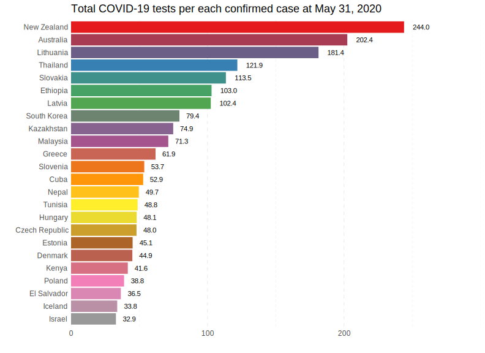
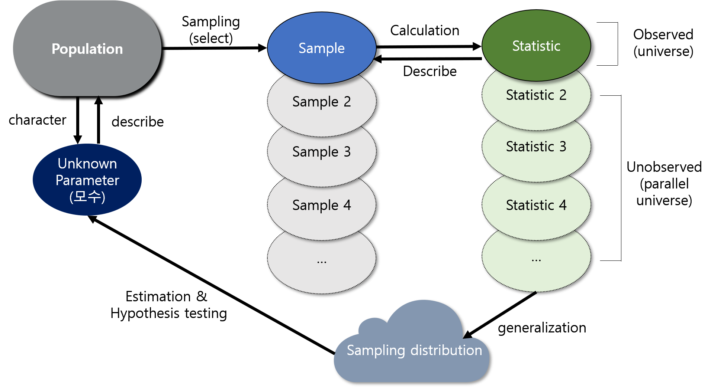

```{r setup-knitr, include=FALSE}
options(htmltools.dir.version = FALSE)
# knitr::opts_knit$set(root.dir='..')
knitr::opts_chunk$set(eval = TRUE, 
                      echo = FALSE, 
                      cache = FALSE,
                      include = TRUE,
                      collapse = FALSE,
                      message=FALSE,
                      warning=FALSE, 
                      dependson = NULL,
                      engine = "R", # Chunks will always have R code, unless noted
                      error = TRUE,
                      fig.path="Figures/",  # Set the figure options
                      fig.align = "center", 
                      #fig.width = 7,
                      #fig.height = 7, 
                      fig.keep='all', fig.retina=3)

```

```{r setup-library}
library(MASS)
library(reshape2)
library(plyr)
library(tidyverse)
library(lubridate)
library(readxl)
library(tidyselect)
library(tidystats)
library(glue)
library(here)
library(gt)
library(gtsummary)
library(kableExtra)

```


class: inverse, center, middle

# Important Terminologies `r emo::ji("book")`

---


# Two types of statistical analysis

> - **Exploratory data analysis**: analyzing data to summarize their main characteristics $\rightarrow$ classical term: **descriptive statistics**


.center[  
]


> - **Statistical inference**:  a set of procedures used in making appropriate conclusions and 
generalizations about a whole (**the population**), based on a limited mumber of observation (**the sample**)


???

In our first class, we learned what statistics is, what it encompasses, and why it is important in today's world with emphasizing the importance of statistical thinking. We also briefly covered some important terms in statistics, such as population, sample, observation, and experiment. 

In this class, we will focus on essential terms that you need to know for our study of statistics this semester. Additionally, when you actually analyze data, there's an important initial step you should always take, which is examining the descriptive characteristics of the data.


<!-- Through the lesson, I also emphasized the need for statistics as a tool to extract information and knowledge from data. -->

<!-- I also mentioned that data can be acquired through observation and experimentation,  -->
<!-- and data are a set of values with quantitative and qualitative variables according to their properties. -->


Statistics can be broadly divided into exploratory data analysis, often refered to descriptive statistics, 
and statistical inference, in which a population is inferred from limited information from the given sample. 

Exploratory data analysis (EDA for short) is primarily aimed to identify the descriptive characteristics of the data. 


How can we identify the characteristics of data? For example, suppose that we've investigated the weight of 60 pigs in certain farm. We're going to measure weights of pigs and record their weights in some sort of sheets. What kind of information could we obtain from the 60 numbers? 

The data themselves are just bunch of numbers or text. From these numbers, we need to extract some meaningful things by calculating some important numbers and drawing graphs. 

In my opinion, among the many aspects of checking data characteristics, the most important things are to determine where the center of the data is, how spread out the observed values are from that center, and how shape observed data are. 


Let's suppose that we've checked these important characteristics mentioned above thorugh EDA. Now, we're questioning whether the average weights of 60 pigs are greater than the average weight of general population of pigs. 


This generalization starts with the assumption that the sample we get follows a certain probability distribution. 

We'll learn about the concept of the probability next week, but this time we'll go over the concept of terminology.


---

# Population and Sample

## Two important terminologies in statistical inference

> - **Population**: the totality of individual observations for the inference

> - **Sample**: a subset of the population or the part of population that we actually examine to gather information $\rightarrow$ expressed as **DATA** 

### EXAMPLE: The prevalence of dementia among the elderly in South Korea

> - **Data**: Prevalence of dementia for 500 samples

> - **Sample**: 500 of ramdomly selected persons more than 65 years in Gwangju

> - **Study population**: All the elderly more than 65 years in Gwanju

> - **Target population**: All the elderly more than 65 years in South Korea

???


Population can be divided into target population and study population in terms of epidemiology.

The term "target population" is mostly accepted as a synonym of "population". 

The term "Target population" is sometimes used to emphasize that the samples we obtain cannot be representative of the entire population.

Study population is the subset of the population (or the target population) with the condition or characteristics of interest defined by the eligibility criteria. 


For example, if the purpose of our study is to investigate the prevalence of dementia among the elderly in South Korea, the whole population of 65 years or older residing in South Korea is our target population of our study.

To sample representing the whole population of the elderly in South Korea, it is ideal if we could obtain samples that reflects the exact population structure of South Korea. However, budget is always not enough and this makes you survey to only the eldely living in Gwangju. Then, your realistic population for the study shrinks to the elderly who live in Gwangju. That is the study population. 


The sample is a subset of the population, and if we actually surveyed 500 elderly people in the study we designed, these 500 persons becomes yuout sample for the study. The act of collecting or extracting sample is called sampling. After sampling, you measure something like age, education level, several questionnaires and the prevalence of the dementia from these samples. These things become your dataset. In most case, sampling and collecting data are done simultaneously. 


---

# Population and Sample

## Schematic diagram for population and samples
<br>

.center[]


???

This figure might provide you better understanding.

Let the largest rectangle represent the total population of the eldely in South Korea. 

The circle on the largest rectangle represents the population more than 65 years in Gwangju.

It looks like a sample set from the population and it is definitely true but we cannot obtain 
all these samples due to the limit of budget and time. 

We are able to obtain the real sample set from this study population. 
This is a sample you can actually examine.


In most lectures for STAT 101, the observation are perfectly randomly sampled from the population 
directly. However, it is a very rare case in the real world. 

When we go over from the data to the sample, our main interest is whether the data we obtained exactly reflect our study purpose. That is, we need to consider the issue for the measurement. When collecting data, we expect that obtained data has a low variablity as much as possible, and is able to be reproducible. That means we hope to obtain reliable data. 

Besides, we also hope to obtain the vaild dataset: that is, we want the data to reflect 
what we really want to measure without any bias.


Ideally, random sampling is the simplest and most effective sampling method, 
but in reality it is very difficult to obtain random samples. It is because of time and money.


---
# Parameters `r icons::fontawesome("bible", style = "solid")`

### Parameters exist somewhere in the universe 

> - $\rightarrow$ the **TRUE VALUE** for representing the target population 
> - $\rightarrow$ **NO ERROR**
> - Usually notated with Greek letters (e.g. $\mu, \sigma, \theta, \psi$, ...)


### From the view of _frequentists_, 

> - Parameters are fixed $\rightarrow$ never changing
> - Parameters exists but we never know the true value of them
> - But we can "guess" them from sample


### In Sum, parameters are 

> - any measured quantity of a population $\rightarrow$ **describe the population**
> - usually infered from the **calculated statistics** $\rightarrow$ from the particular sample of **DATA**


???

The special numbers that determine the characteristics of a population are called parameters. 

The parameter is like a god believed to exist somewhere from the point of view of the frequentist.

That's why parameters regard to flawlessness. In statistics, no error means that this particular number exists alone. 

That is, a paramter is a fixed constant. 

Recall that the breakthrough in statistics took place in Western Europe. 

Western Europe has always admired the Greek civilization. 

Because of this cultural background, I think the parameters are expressed in the Greek alphabet.

In fact, this assumption about parameters is a bit unreasonable. 

Because parameters always change unless the population is fixed. 

Unlike frequentists, statisticians who hold the view that parameters can change, 
that is, parameters can also have probabilistic variation, are called Bayesian.

In other words, from the point of view of frequentists, the parameter is fixed and cannot be changed. 

Parameters are numbers that determine the characteristics of a population. 

They exist somewhere, but like God we never know where the true values are. 

However, the properties of these parameters can be inferred from the samples we obtained. 

If the sample properly reflects the population.

We compute statistics from the sample to estimate the parameters. 

The possible information needed to calculate these statistics is in the sample data we have collected.


---
# What is in the data? 

### Individuals

> - **The objects described by data: not necessarily to be people**
> - What individuals the data describe? people, guinea pig, household, text, shop, ...
> - How many individuals are in the data? $\rightarrow$ the size of sample (data)


### Variables

> - **A measurement made on an individual** $\rightarrow$ **a characteristic of an individual**
> - **Example 1**: A researcher examines people to obtain the prevalence of lung cancer 
>    - Gender, smoking and alcohol comsumption, height, weight, income, ...
> - **Example 2**: 100 trees from Gyeryong Mt. $\rightarrow$ species, height, circumference at chest height


???

So how is the data organized? Mathematically, data is a matrix. 

The matrix is made up of rows and columns. Each row we call an individual. Individual does not have to be a person. 

It can be a person, or it can be a guinea pig, furniture, word, shop, whatever interests you in any research or study.

The number of these indivduals determines the size of the sample.


The features that make up columns in the data are called variables. 

A variable is something measured by an individual. 

That is, it means an element that represents the characteristics of an individual.

For example, suppose a researcher conducts a research on the prevalence of lung cancer. 

Here, individual is an individual person, and the sex, alcohol and smoking, height, and weight measured from this person are variables. 

As another example, in a survey that randomly sampled 100 trees in Gyeryongsan, 
the tree is an individual, and the species, height, and circumference at chest height of the tree will be variables that express the characteristics of the tree.

Everyone, have you come to Daejeon and visit Gyeryongsan? 
If you haven't been there, the cherry blossoms blooming in spring are really pretty, so be sure to visit them.


---

# Types of Variables


```{r}
require(kableExtra)
type <- c("Norminal", 
          "Ordinal", 
          "Interval", 
          "Ratio")
example <- c("sex, marital status, blood type, race, eye colour, religion, ...", 
             "grade, education level, preference, severity, ...", 
             "temperature, IQ, SAT score, ...", 
             "distance, length, height, weight, BMI, blood pressure, ...")
operation <- c("counting", 
               "counting, ranking", 
               "counting, ranking, \\(+\\), \\(-\\), \\(\\times\\), \\(\\div\\)", 
               "counting, ranking, \\(+\\), \\(-\\), \\(\\times\\), \\(\\div\\)")
tab <- data.frame(type, example, operation)
names(tab) <- c("Type", "Example", "Operation")
kable(tab, 
      format = "html", 
      align = "lll", 
      escape = "FALSE", 
      booktabs = TRUE, 
      caption = "Type of Variables") %>% 
  kable_styling(full_width = F) %>% 
  column_spec(1, bold = T, width = "10em") %>% 
  pack_rows("Qualitative variable", 
            1, 2, 
            label_row_css = "background-color: #666; color: #fff;") %>% 
  pack_rows("Quantitative variable", 
            3, 4, 
            label_row_css = "background-color: #666; color: #fff;")
```


???


Variables can be classified into qualitative variables and quantitative variables according to their properties. 

Qualitative variables, also called categorical variables, can be divided into two categories.

Nominal variables are non-ordered. 

In other words, it collectively refers to categorical variables that cannot be assigned an order 
such as gender, marital status, blood type, race, and religion. 

The only operation we can do on these variables is simply counting. 

The ordinal variable literally refers to a variable that has the property of an order. 

Grade, level of education, preference, and severity are representative. 

We can assign ranking to ordinal variable in natural. 

Quantitative variables are also called continuous variables. 

Quantitative variables, like qualitative variables, are also divided into two categories. 

Interval variables are numerical variables that measure relative concepts such as temperature and IQ. 

They have an order, and these variables ale able to apply four arithmetic operations, 
but usually the difference between the two values is meaningful.

The Ratio variable has all the characteristics of the interval variable, 
and is a variable obtained from absolute measurement as shown in the table.

Variables of the highest concept can be converted to any of the lower level of variables (interval, ordinal, nominal). 

This means that the amount of information in the ratio variable is richer than other variables. 

It is impossible to convert the nominal variableinto the upper level of variables such as ordinal or interval. 


---

# Random Variable 

### All variables in the data can be considered as random variables!!

> - **a variable whose value may changing depending on chance**
>    - Example 1: price of a game $\rightarrow$ tossing a coin 
>    - (head: + ￦1000, tail: - ￦1500)
> - symbolized by an upper case letter: $X$, $Y$, $Z$, ... 
>   - $X$:  generally indicating **population**
>   - $X_1, X_2, X_3, \ldots$: indicating **sample**
> - A particular value of a random variable symbolized as a lower case letter: $x$, $y$, $z$, ...
>   - $x_1, x_2, x_3, \ldots$: indicating **observed values**


### We don't know what value comes from a variable!!


???

random variable is simply a number whose value is determined by the outcome of a chance process. 

The amount that the insurance company will pay out in the next year is an example of a random variable: 

its value depends on a complex chance process—how many homeowners experience a flood, how damaging each flood is, etc.

Random variables are actually all variables that exist in the data. 

RV refers to a variable whose value can change according to a probability mechanism. Let me give you the simplest example.

Consider a game that you flip a coin and take 1000 won if the head comes out and lose 1500 won if the tail comes out. 

You don't know if toss a coin to win or lose money. It depends purely on luck. 

If the coin is fair enough, the odds of getting a head or tail are 1/2. 

In other words, you can allocate +1000 won to 1/2 the probability that the heads will come out, 
and -1500 won to the probability that the tail will come out 1/2. 

Here, +1000, -1500 are random variables that can come out of this game structure.


Random variables can be symbolized as uppercase alphabets. 

In general, unnumbered uppercase letters denote the population, and numbered uppercase letters denote the sample, as shown below.

Particular values of a random variable are shown in lowercase, and a series of numbered lowercase letters indicate observed values.

The concept of RV is actually very natural. When we start an investigation or research, 
it's impossible to know exactly what the values of the variables we measure from our subjects are.

The most reasonable option would be to introduce a probability structure 
that quantifies this uncertainty into the measurement of the variable.


---
# Uncertainty, Error and Variability

### **Uncertainty**: lack of knowledge 

> - a sample $\rightarrow$ appropriately represent the population??
> - partially observable or stochastic (a.k.a probabilatic, statistical)


### **Error**: experimental and natural variability

> - repeating to measure the height for a person $\rightarrow$ always identical?
> - Exactly reproducible experiment $\rightarrow$ POSSIBLE??

### Error $\neq$ Uncertainty

> - Both exist to some extent in any scientific research
> - Both are related to **PROBABILITY!!**


???

Many people confused the concept of uncertainty and error. 


Uncertainty refers to epistemic situations involving imperfect or unknown information. 

It applies to predictions of future events, to physical measurements that are already made, 
or to the unknown. Uncertainty arises in partially observable and/or stochastic environments, 
as well as due to ignorance, indolence, or both. 

It arises in any number of fields, including insurance, philosophy, physics, statistics, 
economics, finance, psychology, sociology, engineering, metrology, meteorology, ecology, 
and information science.

Briefly, uncertainty represents the lack of knowledge. 

Previously, I refer a random sampling and its difficulty. 

Consider you obtain a sample dataset and probably you believed in that my sample is definitly reflecting the whole population you concerned. 

Who knows? Your sample may be obtained without crucial information. 


In the other hand, error represents experimental and natural variability. 


For example the yield of a product from a chemical reaction may vary quite considerably from one occasion to another 
due to slight differences of conditions such as temperature, pressure, concentration and agitation rate. 

Other errors will be introduced because of the impossibility of obtaining an entirely representative sample of the product for analysis. 

Finally, no method of chemical analysis of the sampled material will be exactly reproducible. 

Therefore, the error is not a synonym of uncertainty. However, there are several common things: 

Both are present to some extent in any scientific research and related to the probability. 


---
# Probability `r icons::fontawesome("dice", style = "solid")` 

### An crucial tool in statistics 

.center[]

> - tossing a coin $\rightarrow$  what chance of showing head? 
> - rolling a dice 
>   - what is the chance of getting 3? 
>   - what is the chance of getting odd numbers in the next roll? 


### **Probability** 

> - a **random process** giving rise to an outcome 
> - the probability of outcome: **proportion** of times an outcome occur in infinte number of times $\rightarrow$ empricial probability


???

Probability is 


If $E$ is an event, then the probability that $E$ occurs is the long-term proportion of times that the event occurs, 
if we could repeat the random process many, many times.


---

# Probability `r icons::fontawesome("dice", style = "solid")`

###  Example: Coin toss

```{r setting, echo=FALSE}
library(scales)
```


```{r, echo=TRUE}
coin_flip <- function(faces, ntry = 10) {
  record <- sample(faces, size = ntry, replace = TRUE)
  prob1 <- sum(record == faces[1])/ntry
  prob1
} # a function to simulate tossing a coin
x <- numeric(1000) # a space for results
set.seed(12345) # fix the random sequences
coin <- c("H", "T")
# repeat 1000 times
for (i in 1:1000) x[i] <- coin_flip(coin, i)

```

.center[]


???

Probability is a clucial tool to understand statistics.

Some of you may have the following question at this point: I only register a statistics class, 
but why I have to spend so much time in learning probability?

The relationship between probability and statistics can be summarized by saying that 
probability reasons from the population to the sample (deductive reasoning), 
whereas inferential statistics reasons from the sample to the population (inductive reasoning).


Consider tossing a fair coin. What is the chance of showing head?

Consider rolling a die, which is a cube wit six faces labelled as 1-6. 
Suppose that die is also fair: the chance of getting one number is the same as the chance of getting any other number.

What is the chance of getting 3 when rolling a die?
What is the chance of getting a 1 or 2 in the next roll?
What is the chance of not rolling a 4?
Probability is often framed in terms of a random process giving rise to an outcome.

“Tossing a coin” is a random process with all possible outcomes beging head or tail.
“Rolling a die” is a random process with all possible outcomes being 1, 2, 3, 4, 5 or 6.
The probability of an outcome is the proportion of times the outcome would occur if we observed the random process an infinite number of times.

---

# Probability Distribution 


#### A random variable alway have a specific distribution depending on the structure of the probability


#### - Specific structure $\rightarrow$ **probability distribution**

> - a mathematical function that gives the probabilities of occurrence of different possible outcomes (a.k.a. random variable) for an experiment

#### Example 

> Let the oucome of a coin toss (experiment) denote $X$
> - $X = x_1$ (head) $\rightarrow$ 0.5
> - $X = x_2$ (tail) $\rightarrow$ 0.5


.center[]


## A probability distribution have a role to assign a probability to the observed outcome 


???


---
# Expectation 

### Suppose Chicago Bulls in the NBA Tournament

> - In long term, how many times Chicago Bulls get into the tournament? 
> - How many times the head occurs when tossing a coin repeatedly many many times in average?
> - How much money can you expect when playing roulette at a casino for many many times?
> - $\rightarrow$ a concept of **Average!!**


### Imagine the number of trial (process) becomes $\infty$


### Expected value

> - the number that this average converges to
> - Often called as **mean** of a random variable $X$
> - denoted as $\mu_X$ or $E(X)$


???

When it comes to random variables, we are often interested in what it might turn out to be on average. 
That is, suppose we could repeat the random process many, many times—say n times, where n is some large number. 
(Suppose that we could observe the insurance company for many, many years, 
with each year being the same in terms of how many people are insured, 
how much their houses are worth, 
what the climate is like, and so on.) 

Each time the process is repeated, we get a value for the random variable. We end up with n values. 
Now add up these values and divide by n. 
We have computed their average—the mean, as it is properly called. Now imagine that ncould be larger and larger, without bound.


---
# Sample Statistics $\sum$

### Estimating parameters 

> - calculating **SAMPLE STATISTICS** (a.k.a. **estimator of the population parameter**)
> - **SAMPLE STATISTICS** varied from **different samples of data** $\rightarrow$ inevitably involves **ERROR** $\rightarrow$ **HAVE PROBABILITY DISTRIBUTION**
> - A sample statistic should never to be quoted without some estimate of its variation
> - **standard error (SE)** of the sample statistic


$$
\mathrm{SE} = \frac{\hat\sigma}{\sqrt{N}}
$$


### How good is our estimate? $\rightarrow$ less error (variation) and how closer to the true parameter


???

The first step in estimating a parameter is to calculate statistics from the sample for the parameter of interest. 
When many researchers look at sample data, they tend to think that it is the only sample in the world. 

In fact, in statistics, the sample we obtained is assumed to be one chosen by chance from a large set of samples. 

For example, it is unlikely that the party preferences surveyed by research firm A would be exactly the same for firm B. 

That's why it makes sense to think that the statistics we computed from the samples is also a part of numurous possible results.

That is, the sample statistics depend on different sample data.

Therefore, sample statistics also have a probability structure and therefore it has a probability distribution consequently. 


---


# Estimation & Hypothesis testing

### Two basic branches of statistical inference

> - **Estimation**
> - **Hypothesis test**

#### Both make use of statistics calculated from sample data

#### The choise of which to use depends on the question

> - What is the value of something? $\rightarrow$ estimation
> 
>  Versus.
>
> - Are two things the same? $\rightarrow$ hypothesis testing


The basic principle of estimation & hypothesis are the same for **ALL** types of parameters and statistics 
but the details may change. 

- test statistics 
- standard error
- probability distribution


???

There are two basic branches of statistical inference: estimation and hypothesis testing.

Both make use of statistics calculated from sample data, and each has a specific role to play in statistical inference. The choice of which to use depends on the question being asked.

What is the value of something? - This would entail estimation.
Versus

Are two things the same? – This would entail hypothesis testing.
The basic principles of estimation & hypothesis testing are the same for ALL types of parameters and statistics. 

However, the details may change. For example: How to calculate the test statistic & estimate the standard error, 
and what probability distribution to use, are both important considerations in any inferential procedure and have situation-specific nswers (which we will deal with later).

BUT

If you have a basic understanding of the concepts you will easily cope with most situations.


---

# Scheme of Statistical Inference

<br/><br/>

.center[]

.center[##### Schematic relationship between population, sample, statistic, and sampling distribution]


 


<!-- ```{r tossing-coin} -->
<!-- # svg("slides/assets/imgs/tossing-coin-prop.svg", width = 1209, height = 600) -->
<!-- plot(x, xlab = "Number of tosses", ylab = "Proportion of Head", -->
<!--      pch=16, cex = 1.5, col = alpha("black", 0.4), -->
<!--      main = "Proprotion of heads as number of tosses increases") -->
<!-- abline(h = 0.5, col = "red", lwd = 3) -->
<!-- # dev.off() -->

<!-- ``` -->


<!-- ```{r distribution-ex, fig.width=15, fig.height=7, out.width="50%"} -->
<!-- par(mfrow = c(1, 3)) -->
<!-- dx <- seq(1, 5, by = 1) -->
<!-- barplot(dbinom(dx, 10, 0.2), border = "gray",  -->
<!--         main = "Binomial distribution") -->
<!-- dx <- seq(0, 1, length = 100) -->
<!-- plot(x = dx, y = dunif(dx), type = "l",  -->
<!--      xlab = "X", ylab = "Density",  -->
<!--      main = "Uniform distribution", bty = "n") -->
<!-- polygon(c(0, dx, 1), c(0, dunif(dx), 0), col = "gray", border = "gray") -->

<!-- dx <- seq(-4, 4, length = 500) -->
<!-- plot(x = dx, y = dnorm(dx, mean = 0, sd = 1), type = "l",  -->
<!--      main = "Normal distribution", bty = "n") -->
<!-- polygon(c(-4, dx, 4), c(0, dnorm(dx), 0), col = "gray", border = "gray") -->


<!-- ```   -->


<!-- ```{r, fig.width=12, fig.height=6, out.width="50%"} -->
<!-- set.seed(12345) -->
<!-- x <- rnorm(1000, -1, 1) -->
<!-- y <- rnorm(600, 3, 1) -->
<!-- z <- c(x, y) -->
<!-- par(mfrow = c(1, 2)) -->
<!-- hist(x, breaks = 20, main = "Unimodal distribution") -->
<!-- abline(v = mean(x), col = "red", lwd = 2) -->
<!-- hist(z, breaks = 20, main = "Bimodal distribution") -->
<!-- abline(v = mean(x), col = "red", lwd = 2) -->
<!-- abline(v = mean(y), col = "red", lwd = 2) -->

<!-- ``` -->


<!-- ```{r mode-masking} -->
<!-- set.seed(12345) -->
<!-- x <- rnorm(1500, -1, 1) -->
<!-- y <- rnorm(600, 3, 1) -->
<!-- z <- rnorm(900, 6, 1) -->
<!-- z <- c(x, y, z) -->
<!-- hist(z, breaks = 5) -->
<!-- par(mfrow = c(1, 3)) -->
<!-- hist(z, breaks = 300, main = "Bin = 300: Too Many") -->
<!-- hist(z, breaks = 60, main = "Bin = 60: Appropriate?") -->
<!-- hist(z, breaks = 10,  main = "Bin = 10: 2 peaks?") -->

<!-- ``` -->


<!-- ```{r multi-unimodel} -->
<!-- set.seed(12345) -->
<!-- x <- rnorm(1500, -1, 1) -->
<!-- y <- rnorm(900, 2, 2) -->
<!-- z <- c(x, y) -->
<!-- par(mfrow = c(1, 3)) -->
<!-- hist(z, breaks = 600, main = "Bin = 600: Too many?") -->
<!-- hist(z, breaks = 120, main = "Bin = 120: Bimodal?") -->
<!-- hist(z, breaks = 12,  main = "Bin = 12: Proper") -->


<!-- ``` -->


<!-- ```{r dist-sym, fig.width=10, fig.height=6, out.width="60%", dev='svg'} -->

<!-- # unimodal  -->
<!-- set.seed(12345) -->
<!-- x <- rnorm(2000, -1, 1) -->
<!-- y <- rnorm(2000, 4, 1) -->
<!-- z <- c(x, y) -->

<!-- par(mfrow = c(1, 2)) -->

<!-- hist(x, main = "Unimodal distribution",  -->
<!--      cex.main = 2) -->
<!-- abline(v = mean(x), lwd = 1.5, col = "red") -->
<!-- hist(z, main = "Bimodal distribution",  -->
<!--      cex.main = 2) -->
<!-- abline(v = mean(z), lwd = 1.5, col = "red") -->


<!-- ``` -->


<!-- ```{r} -->
<!-- par(mfrow = c(1, 2)) -->
<!-- # skewed to the left -->
<!-- set.seed(12345) -->
<!-- x <- rnorm(500, -3, 6) -->
<!-- y <- rnorm(1500, 8, 3) -->
<!-- z <- c(x, y) -->
<!-- hist(z, breaks = 30, main = "Skewed to the Left",  -->
<!--      cex.main = 2, yaxt = "n", ylab = "") -->
<!-- abline(v = mean(z), lwd = 1.5, lty = 1, col = "red") -->
<!-- abline(v = median(z), lwd = 1.5, lty = 2, col = "blue") -->
<!-- legend("topright", legend = c("Mean", "Median"),  -->
<!--        lty = 1:2, col = c("red", "blue"), bty = "n", lwd = 1.5, -->
<!--        cex = 1.5) -->


<!-- # skewed to the right -->
<!-- set.seed(12345) -->
<!-- x <- rchisq(1500, 5) -->
<!-- hist(x, breaks = 30, main = "Skewed to the Right",  -->
<!--      cex.main = 2, yaxt = "n", ylab = "") -->
<!-- abline(v = mean(z), lwd = 1.5, lty = 1, col = "red") -->
<!-- abline(v = median(z), lwd = 1.5, lty = 2, col = "blue") -->
<!-- legend("topright", legend = c("Mean", "Median"),  -->
<!--        lty = 1:2, col = c("red", "blue"), bty = "n", lwd = 1.5, -->
<!--        cex = 1.5) -->


<!-- ``` -->

