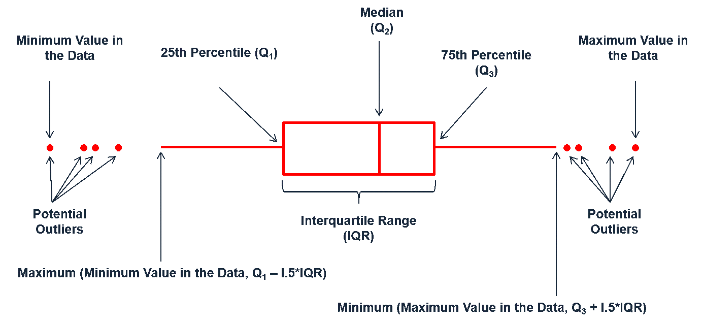

```{r setup-knitr, include=FALSE}
options(htmltools.dir.version = FALSE)
# knitr::opts_knit$set(root.dir='..')
knitr::opts_chunk$set(eval = TRUE, 
                      echo = FALSE, 
                      cache = FALSE,
                      include = TRUE,
                      collapse = FALSE,
                      message=FALSE,
                      warning=FALSE, 
                      dependson = NULL,
                      engine = "R", # Chunks will always have R code, unless noted
                      error = TRUE,
                      fig.path="Figures/",  # Set the figure options
                      fig.align = "center", 
                      #fig.width = 7,
                      #fig.height = 7, 
                      fig.keep='all', fig.retina=3)

```

```{r setup-library}
library(MASS)
library(reshape2)
library(plyr)
library(tidyverse)
library(lubridate)
library(readxl)
library(tidyselect)
library(tidystats)
library(glue)
library(here)
library(gt)
library(gtsummary)
library(kableExtra)

```


class: inverse, center, middle


# How to Explore (Describe) Data by Number? `r emo::ji("zoom")` `r icons::fontawesome("sort-numeric-down", style = "solid")`

---

# Features of Data 

## How Data Looks Like ...

> Identified by Graphs and Several Numbers (a.k.a. **STATISTICS**)

## **REMEMBER**

### **Center**: General tendency of data

### **Unusual features**: Very far from the rest of data

### **Spread**: The variability of data

### **Shape**: Identified by Visualization (e.g. Histogram)


> Acronym: **CUSS**


???

**Center**

One of the most fundamental features of a dataset is its center.

In simple terms, the center represents a typical or middle value that summarizes the dataset. It gives us an idea of where the “middle” of the data lies.

There are several common ways to define the center:

Mean: The arithmetic average of all observations. It is useful for numerical data and is often used in statistical calculations. However, it can be sensitive to extreme values or outliers.

Median: The middle value when the data are ordered from smallest to largest. The median is robust to outliers and is often preferred when the data are skewed.

Mode: The value that occurs most frequently. The mode is particularly helpful for categorical data or when identifying the most common observation is important.

Understanding the center helps us summarize the dataset quickly and provides a reference point for other analyses, such as measuring variability or detecting unusual observations.

**Unusual features**

Unusual features are observations that fall far from the majority of the data. These extreme values, or outliers, can have a significant effect on statistical analyses:

They may skew averages, inflate variability measures, or cause instability in models.

Identifying these observations is important, but it is equally important to understand why they occur.

Common reasons for unusual observations include:

Data entry errors: Large datasets often include manually recorded data, which can introduce mistakes. For example, typing “1000” instead of “100” could create an extreme value.

Non-representative observations: Some data points may not belong to the population of interest. In medical research, a patient with a rare condition might distort the overall results if included incorrectly.

True exceptional cases: Sometimes extreme values indicate a real, interesting phenomenon. Many scientific discoveries have arisen from noticing such unexpected results. Famous examples include Einstein’s theory of relativity, which challenged classical physics, and Pasteur’s discovery of microbial fermentation.

Careful examination of unusual features helps prevent misleading conclusions and can even lead to new insights.

**Spread**

The spread of a dataset measures how dispersed the values are around the center. Understanding spread is important because it tells us whether the data are tightly clustered or widely scattered.

Key measures of spread include:

Range: The difference between the maximum and minimum values. Simple but very sensitive to outliers.

Interquartile Range (IQR): The range of the middle 50% of the data. Less affected by extreme values and often visualized in a boxplot.

Variance and Standard Deviation: These measures quantify the average squared deviation from the mean, giving a more precise idea of how the data are distributed. Standard deviation is in the same unit as the data, making it easier to interpret.

Datasets with a large spread cover a wide range of values, while those with a small spread are tightly clustered around the center.

Practical point: Two datasets can have the same mean but very different spreads. Understanding spread is critical for reliability and comparison of data.


**Shape**

Shape refers to the overall pattern of the data, usually observed through graphical displays such as histograms or density plots.

The shape of the data can reveal important information about the underlying structure and guide the choice of statistical methods:

Symmetric distributions: Values are evenly distributed around the center, like in a normal distribution. Many statistical tests assume symmetry.

Skewed distributions: One tail is longer than the other. Right-skewed (positive skew) distributions have long tails to the right; left-skewed (negative skew) distributions have long tails to the left. Skewness affects the interpretation of mean and median.

Unimodal or multimodal distributions: Unimodal data have a single peak, while multimodal data have multiple peaks, which may indicate distinct subgroups or processes in the data.

Understanding the shape helps detect patterns, identify potential outliers, and select appropriate statistical procedures for analysis.
---

# Measures of Location `r icons::fontawesome("location-arrow", style = "solid")`

## Where is the center? 

### **Sample mean**: often called the average, arithmetic mean 

Consider the sample $X_1, \ldots, X_n$ drawn from a population $X$. Its **sample mean** is given by 


$$
\bar{X} = \frac{1}{n}\sum_{i=1}^{n} X_i = \frac{1}{n} (X_1 + \cdots, +X_n)
$$


> - Example: calculate the mean of five numbers $\{6.5, 6, 5.5, 7.5, 8\}$


$$
\bar{X} = \frac{1}{5} (6.5 + 6 + 5.5 + 7.5 + 8) = 6.7
$$

> Question: is $\bar{X}$ a random variable?


#### **Answer**: **Yes** $\rightarrow$ Then what characteristic have?


???

“Let’s begin today’s session by asking a simple but fundamental question:

📍 Where is the center of our data?
When we collect data from a population, one of the first things we want to know is:
What value best represents the whole group?
This leads us to one of the most widely used measures of location—the sample mean, also known as the average or arithmetic mean.
So, suppose we have a sample of size n, drawn from a population X.
We denote the sample as $X_1, X_2, \ldots, X_n$, and the sample mean is calculated using this formula:

$\bar{X} = \frac{1}{n}\sum_{i=1}^{n} X_i = \frac{1}{n} (X_1 + X_2 + \cdots + X_n)$

This formula simply tells us:
👉 Add up all the values in the sample, then divide by how many values you have.

Let’s walk through a quick example. Imagine we have five numbers: ${6.5, 6, 5.5, 7.5, 8}$.

To find the mean, we calculate:

$\bar{X} = \frac{1}{5} (6.5 + 6 + 5.5 + 7.5 + 8) = 6.7$

So the average of this sample is 6.7.

Now here’s a deeper question:
💡 Is \bar{X}—the sample mean—a random variable?

The answer is: Yes, it is.

Why? Because the sample itself is drawn randomly from the population.
Each time we take a different sample, we might get a different mean.
So the sample mean varies depending on which data points we happen to observe.
That means \bar{X} has its own distribution, its own expected value, and its own variance.

We’ll explore those characteristics in more detail shortly—but for now, just remember:
👉 The sample mean is not fixed—it’s a random variable that reflects the randomness of sampling.

<!-- Let’s keep going and see what properties this random variable has, and how it helps us understand the population it comes from.” -->

In physics, the expectation holds the same meaning as the center of gravity. 
The distribution can be represented by a series of weights at each outcome, 
and the mean represents the balancing point.


---
# Measures of Location `r icons::fontawesome("location-arrow", style = "solid")`

## Where is the center? 


```{r, out.width="70%", fig.align='center'}
knitr::include_graphics("assets/imgs/mean-viz.gif")
```

.center[[**Illustration of the physical characteristics of the sample mean**](http://statisticsbypeter.blogspot.com/2014/05/arithmetic-mean.html)]


???

“Now that we've seen how to calculate the sample mean, let’s take a moment to understand what it really represents—physically and conceptually.
Take a look at this animation.
What you’re seeing is a visual metaphor: the mean as a fulcrum, or balancing point, of a distribution.
Imagine each data point as a weight placed on a lever.
If we were to balance that lever perfectly, the point where it balances—that’s the mean.
📌 This is more than just a metaphor. Mathematically, the arithmetic mean is the point at which the sum of the distances to all data points, weighted by their values, is minimized.
In other words, it’s the center of gravity of the data.
Let’s break that down:
- If you shift one data point further from the mean, the balance tilts.
- If you add a heavier value (a larger number), it pulls the center toward itself.
- The mean adjusts to maintain equilibrium across the entire distribution.
This physical interpretation helps us understand why the mean is sensitive to outliers.
Just like a heavy weight far from the center can tip a seesaw, an extreme value can pull the mean away from the bulk of the data.
So when we say the mean is a measure of central tendency, we’re not just talking about a formula.
We’re talking about a dynamic balance point—a value that reflects the entire distribution’s weight and position.
Keep this image in mind as we move forward.
It’ll help you intuitively grasp why the mean behaves the way it does, especially when we compare it to other measures like the median or mode.”


---
# Measures of Location `r icons::fontawesome("location-arrow", style = "solid")`

## Where is the center? 

###  Example: calculate the sample mean


.pull-left[
```{r, echo=TRUE}
# show the first 6 rows
head(cars)

```
]

.pull-right[
```{r, echo = TRUE}
# show data summary results
summary(cars)
```
]

Sample mean for a specific variable

```{r echo = TRUE}
# generic function to calculate the sample mean
barx <- mean(cars$speed); barx
```

???


The arithmatic mean can easily be calculated in R by using the function mean(). We first extract the column 
we are interested in using the notation: DataSet$ColumnName 
where the signifies grabbing the column.


---

# Measures of Location `r icons::fontawesome("location-arrow", style = "solid")`

## What value exactly split data in half? `r icons::fontawesome("star-half-alt", style = "solid")`

### **Sample Median**: The middlemost observation in the ordered data 

> - when the size of data is even, the meadian becomes the mean of the two middlemost value. 

### Calculation of the median value (simple examples)

>- Suppose we have 5 observations $\{6, 2, 4, 3, 8 \}$
>   - Ordering: $\{6, 2, 4, 3, 8 \} \rightarrow \{2, 3, 4, 6, 8 \}$ 
>   - Median value: 4


>- Suppose we have 6 observations $\{10, 2, 6, 5, 4, 2 \}$
>   - Ordering: $\{10, 2, 6, 5, 4, 2 \} \rightarrow \{2, 2, 4, 5, 6, 10 \}$ 
>   - Median value: $(4 + 5)/2 = 4.5$


???


“Now that we’ve explored the sample mean, let’s turn our attention to another important measure of location: the sample median.

While the mean gives us a sense of balance, the median answers a different question:

📍 What value splits the data exactly in half?

The median is the middlemost observation when the data is arranged in order.
It’s the point where half the values lie below, and half lie above.
Let’s look at two simple examples to understand how it works.

🔹 First, suppose we have 5 observations:
{6, 2, 4, 3, 8}
Step one is to sort the data:
{2, 3, 4, 6, 8}
Since we have an odd number of observations, the median is simply the middle value:
👉 4

🔹 Now let’s try with 6 observations:
{10, 2, 6, 5, 4, 2}
Sorted, this becomes:
{2, 2, 4, 5, 6, 10}
This time, the number of observations is even.

So we take the two middle values—4 and 5—and calculate their average:
$\text{Median} = \frac{4 + 5}{2} = 4.5$

So to summarize:

- If the number of observations is odd, the median is the middle value.
- If it’s even, the median is the mean of the two middle values.

This makes the median a very useful tool, especially when your data contains outliers.
Unlike the mean, the median is resistant to extreme values—it focuses purely on position, not magnitude.

In the next slide, we’ll compare the mean and median side-by-side to see how they behave under different data conditions.


---

# Measures of Location `r icons::fontawesome("location-arrow", style = "solid")`

## What value exactly split data in half? `r icons::fontawesome("star-half-alt", style = "solid")`


```{r, out.width="70%", fig.align='center'}
knitr::include_graphics("assets/imgs/MedianVisual.gif")
```

.center[[**Illustration of deriving sample median**](http://statisticsbypeter.blogspot.com/2014/05/median.html)]


???

This visual method is especially helpful when teaching students or explaining the concept to non-technical audiences.

It emphasizes that the median is based on position, not magnitude.

In other words, it doesn’t matter how large or small the values are—it only matters where they fall in the ordered sequence.

That’s why the median is so robust against outliers.

Extreme values at either end don’t affect the middle position unless they change the order itself.

So whenever you’re working with skewed data or values that vary wildly, the median can often give a more reliable sense of central tendency than the mean.


---
# Measures of Location `r icons::fontawesome("location-arrow", style = "solid")`

## What value exactly split data in half? `r icons::fontawesome("star-half-alt", style = "solid")`

###  Example: calculate the sample median

> using `median()` function


```{r, echo=TRUE, results='hold'}
median(cars$speed)
median(cars$dist)
```


### CHECK

#### The median value is more **robust** than the sample mean. 


--


???

In R the median is easily calculated by the function median().

Median is often known as a rubust estimator of the central tendency. Can you guys guess why? 

<!-- I will leave the explanation for this part as your homework. -->


---


# Measures of Location `r icons::fontawesome("location-arrow", style = "solid")`

## What values frequently occur in your data? 

### Mode: peak(s) in the distribution of data 

> - two or more items have the highest occurrence, they are all the mode
> - each value occurs equally $\rightarrow$ no mode

### Peaks (modes) can be multiple

.center[]


???

“Now let’s explore another measure of location: the mode.

While the mean and median tell us about the center of the data, the mode answers a different question:

📍 Which values occur most frequently?

The mode is defined as the value—or values—that appear most often in a dataset.

It’s the peak of the distribution, the point where the data piles up.

Let’s clarify a few key points:

- If one value occurs more than any other, that’s the mode.
- If two or more values tie for the highest frequency, then all of them are considered modes.
- And if every value occurs equally? Then there’s no mode—the data is uniformly distributed.

Now, take a look at this image.
It shows two types of distributions:
🔹 On the left, we have a unimodal distribution.
There’s a single clear peak—one value that dominates in frequency. That’s the mode.
🔹 On the right, we see a bimodal distribution.

Here, there are two distinct peaks—two values that occur most frequently.
Both are considered modes.

This visual helps us understand that the mode isn’t always a single number.
In fact, some datasets can be multimodal, with several peaks—especially in complex or mixed populations.

Also note: unlike the mean and median, the mode doesn’t require numerical data.
It can be used with categorical variables too—for example, the most common color, brand, or response in a survey.

So to summarize:

 - The mode tells us what’s popular in the data.
 - It’s useful for identifying clusters, trends, or repeated patterns.
 - And it’s especially helpful when working with non-numeric or skewed data.


---
# Measures of Location `r icons::fontawesome("location-arrow", style = "solid")`

## What values frequently occur in your data? 

- The **mode** is not often used but helps a nice description of data
- When plotting a histogram of the multimodal data (continuous), the mode is affected by the choice of bins. 

### Normal mixture (trimodal)

.center[]


???

“Let’s continue our discussion on the mode by looking at how it behaves in continuous data—especially when visualized using histograms.

As we mentioned earlier, the mode represents the most frequently occurring value—or values—in a dataset.

While it’s not as commonly used as the mean or median, the mode can offer a rich description of the data’s structure, especially when there are multiple peaks.

Now, take a look at this image.

It shows a normal mixture distribution—specifically, a trimodal one.

That means the data has three distinct peaks, or modes.

But here’s the catch:
📌 The appearance of these modes depends heavily on how we choose the bin size in the histogram.
   - If the bins are too narrow, the histogram may look noisy or fragmented, making it hard    to identify meaningful peaks.
   - If the bins are too wide, the finer details get smoothed out—and some modes may be    completely masked.

This is a great example of how visualization choices can influence interpretation.

Even though the underlying data has three modes, a poorly chosen bin size might make it look unimodal—or even hide the structure entirely.

So when working with multimodal data, especially continuous distributions, it’s important to:
   - Experiment with different bin sizes
   - Use kernel density plots or other smoothing techniques
   - And always interpret histograms with caution

The mode is sensitive to these visual parameters, but when used carefully, it can reveal clusters, subgroups, or hidden structure in your data that other measures might miss.


---
# Measures of Location `r icons::fontawesome("location-arrow", style = "solid")`

## What values frequently occur in your data? 

### What if too many bins were used to the histogram for an unimodal distribution? 


.center[]


---
# Measures of Spread `r icons::fontawesome("people-arrows", style = "solid")` 

## How is the range of data? `r icons::fontawesome("exchange-alt", style = "solid")`

**Range**: distance from the largest (maximum) to the smallest (minimum) value in the data

> - highlt affected by a single extreme value

```{r, echo=TRUE}
r <- diff(range(cars$speed)); r # calculate range of a single variable
```

**Inter-Quartile Range (IQR)**: a distance b/w 25<sup>th</sup> and 75<sup>th</sup> percentile (used in the **BOXPLOT**)

> - $p^{th}$ percentile: In ordered data, the obs. that has at most $p$ percent of the obs. below it and $1-p$ above it ( $0 \leq p \leq 100$ )
> - median: 50<sup>th</sup> percentile

####  Example: calculate IQR

.pull-left[
```{r, echo = TRUE}
iqr <- IQR(cars$dist) # calcuate IQR
iqr_check <- quantile(cars$dist, 0.75) - quantile(cars$dist, 0.25)
```
]

.center[
```{r}
icons::fontawesome("arrow-right", style = "solid")
```

]


.pull-right[
```{r, prompt=NA, comment=NA}
c(iqr_fun = iqr, iqr_quantile = iqr_check)
```
]


???

“Now that we’ve explored measures of location like the mean, median, and mode, let’s shift our focus to something equally important—measures of spread.

📌 In other words: how spread out is the data?

How far apart are the values from each other?

Let’s start with the simplest measure: the range.

The range is defined as the distance between the maximum and minimum values in a dataset.

It’s calculated by subtracting the smallest value from the largest.

For example, in R we can compute the range of the cars$speed variable like this:


This gives us a quick snapshot of how wide the data is spread.

But here’s the catch:
👉 The range is highly sensitive to outliers.

A single extreme value—either very high or very low—can dramatically inflate the range, even if the rest of the data is tightly clustered.

So while the range is easy to compute, it’s not always reliable for understanding the true variability in the data.

That brings us to a more robust measure: the Inter-Quartile Range, or IQR.
The IQR measures the spread of the middle 50% of the data.
Specifically, it’s the distance between the 25th percentile (Q1) and the 75th percentile (Q3).

$\text{IQR} = Q_3 - Q_1$

This is especially useful when visualizing data with a boxplot, where the IQR defines the width of the box.

Let’s break down the concept of percentiles:

   - The p^{th} percentile is the value below which p% of the data falls.
   - The median is the 50th percentile—half the data lies below it, half above.

In R, we can calculate the IQR of cars$dist like this:


Both methods give us the same result—just two ways of expressing the same idea.

So to summarize:

   - The range gives a quick sense of spread but is vulnerable to outliers.
   - The IQR focuses on the central portion of the data and is much more robust.

In the next slide, we’ll look at how these measures behave in skewed distributions and how they can guide us in choosing appropriate statistical summaries.”


---
# Measures of Spread `r icons::fontawesome("people-arrows", style = "solid")` 

### How spread is the data from the (sample) mean? 

### **Sample Variance**

> the **average distance** of the observation to the **mean**

Let's consider the $i^{th}$ **deviation** $\rightarrow$ difference (distance) from the sample mean

$$e_i = x_i - \bar{x} $$
### Mean of deviation is always 0!! See

--


$$\sum_{i=1}^{n}(x_i - \bar{x}) = \sum_{i=1}^{n}x_i - \sum_{i=1}^{n}\bar{x} = n\frac{1}{n}\sum_{i=1}^{n}x_i - n\bar{x} = n\bar{x} - n\bar{x} = 0$$ 

--

### How to solve?? 

--

> - Taking absolute $|e_i|$ or square $e_i^2$ $\rightarrow$ $e_{i}^2$ is more appropriate $\rightarrow$ **WHY??**


???

Let’s continue exploring how we measure the spread of data—this time, by looking at one of the most fundamental concepts in statistics: the sample variance.

So far, we’ve talked about the range and the interquartile range, which give us a sense of how far apart values are.

But now we ask a more precise question:
📌 How far, on average, are the data points from the mean?

This leads us to the idea of deviation.
Let’s define the deviation for the i^{th} observation as:

$e_i = x_i - \bar{x}$

In other words, it’s the difference between each data point and the sample mean.

It tells us how far each value strays from the center.

Now here’s something interesting:

If we take the average of all these deviations, we always get zero.
Let’s prove it:

$\sum_{i=1}^{n}(x_i - \bar{x}) = \sum_{i=1}^{n}x_i - \sum_{i=1}^{n}\bar{x} = n\bar{x} - n\bar{x} = 0$


This makes sense—some values are above the mean, some below, and they cancel each other out.

But that’s a problem if we want to measure spread.

We can’t just average the deviations, because they sum to zero.

So how do we fix this?

We need to transform the deviations so they don’t cancel out.

There are two common approaches:

   - Take the absolute value: |e_i|
   - Take the square: e_i^2

In practice, we use the squared deviations. Why?

   - Squaring ensures all values are positive.
   - It penalizes larger deviations more heavily.
   - And it leads to elegant mathematical properties—especially when working with normal distributions and inferential statistics.


<!-- The big problem is that about half the deviates are negative and the others are positive.  -->
<!-- What we really care is the distance from the mean, not the sign. So we could either take the absolute value, or square it. -->

<!-- There are some really good theoretical reasons to chose the square option.  -->
<!-- Squared terms are easier to deal with computationally when compared to absolute values.  -->
<!-- More importantly, the spread of the normal distribution is parameterized via squared distances from the mean.  -->
<!-- Because the normal distribution is so important, we’ve chosen to define the sample variance so it matches up with  -->
<!-- the natural spread parameter of the normal distribution.  -->
<!-- So we square the deviations and find the average deviation size (approximately) and call that the sample variance. -->


---

# Measures of Spread `r icons::fontawesome("people-arrows", style = "solid")` 

### How spread is the data from the (sample) mean? 

### **Sample Variance** is defined as 

$$\hat\sigma^2 = s^2 = \frac{1}{n-1}\sum_{i=1}^{n} (x_i - \bar{x})^2 $$

### Why divided by $n-1$ instead of $n$ ?

> - underestimate the population variance $\sigma^2$
> - If the true mean (population mean) is known, the equation of variance is 

$$\sigma^2 = \frac{1}{n}\sum_{i=1}^{n} (x_i - \mu)^2 $$


> - We use an estimates of population mean $\bar x$ for the estimation of the $\sigma^2$ $\rightarrow$ using one **degree of freedom**


???

Now that we’ve introduced the concept of sample variance, let’s take a closer look at the formula and understand why it’s structured the way it is.

The sample variance is defined as:

$$\hat\sigma^2 = s^2 = \frac{1}{n-1} \sum_{i=1}^{n} (x_i - \bar{x})^2$$

This measures how spread out the data is from the sample mean.

But here’s the key question:📌 Why do we divide by n - 1 instead of n?

To answer that, let’s first consider the formula for population variance, which assumes we know the true population mean \mu:

$\sigma^2 = \frac{1}{n} \sum_{i=1}^{n} (x_i - \mu)^2$

This version divides by n because we’re using the actual population mean—no estimation involved.

But in practice, we rarely know $\mu$. Instead, we estimate it using the sample mean $\bar{x}$. And here’s the subtle but important point:

👉 When we use $\bar{x}$ instead of $\mu$, we’re introducing uncertainty.

We’re estimating the spread based on an estimated center. This means our variance calculation tends to underestimate the true population variance.

To correct for that bias, we divide by n - 1 instead of n. This adjustment is known as **Bessel’s correction**. Why n - 1?

Because once we’ve calculated the sample mean, only n - 1 of the deviations are free to vary.

The last one is determined by the others—this is what we call losing one degree of freedom.

So to summarize:

   - Dividing by n assumes we know the true mean—ideal but unrealistic.
   - Dividing by n - 1 corrects for the bias introduced by estimating the mean.
   - It ensures our sample variance is an unbiased estimator of the population variance.


<!-- Degrees of freedom are the number of independent variables that can be estimated in a statistical analysis and tell you how many items can be randomly selected before constraints must be put in place. -->

<!-- Within a data set, some initial numbers can be chosen at random. However, if the data set must add up to a specific sum or mean, for example, the number in the data set is constrained to evaluate the values of all other values in a data set, then meet the set requirement. -->

<!-- Degrees of freedom tell you how many units within a set can be selected without constraints to still abide by a given rule overseeing the set. For example, consider a set of five items that add to an average value of 20. Degrees of freedom tell you how many of the items (4) can be randomly selected before constraints must be put in place. In this example, once the first four items are picked, you no longer have the liberty to randomly select a data point because you must "force balance" to the given average. -->


---

# Measures of Spread `r icons::fontawesome("people-arrows", style = "solid")` 

### How spread is the data from the (sample) mean? 

#### Calculating the sample variance by hand

> - data: 3, 6, 2, 4, 7 $\rightarrow$ $\bar x$ = `r mean(c(3, 6, 2, 4, 7))`


```{r}
xi <- c(3, 6, 2, 4, 7); mx <- mean(xi)
dev <- xi - mx
devsq <- dev^2
summ <- c("\\(\\sum\\)", 0, sum(devsq))
tab <- tibble(`\\(x_i\\)` = xi, 
              `\\(x_i - \\bar x\\)` = dev, 
              `\\((x_i - \\bar x)^2\\)` = devsq) %>% 
  mutate_all(as.character)
tab <- rbind(tab, summ)
tab %>% 
  kableExtra::kbl(format = "html", 
      align = "ccc", 
      escape = "FALSE", 
      booktabs = TRUE, 
      caption = "Calculation of the Sample Variation") %>% 
  kableExtra::kable_paper(bootstrap_options = "condensed", 
                          font_size = 15) %>% 
  kableExtra::row_spec(6, bold = T) 


```

the sample variance is


$$s^2 = \frac{17.2}{n -1} = \frac{17.2}{4} = 4.3$$


---

# Measures of Spread `r icons::fontawesome("people-arrows", style = "solid")` 

### How spread is the data from the (sample) mean? 

.pull-left[

####  Example: calculate the sample variance

```{r, echo=TRUE, comment=NA}
# calculate sample variance
xi <- c(3, 6, 2, 4, 7)
var(xi)

```


```{r, echo=TRUE, comment=NA}
# Calculate sample variance in iris dataset
data(iris)
apply(iris[, 1:3], 2, var)

```

]


.pull-right[

The problem of the sample variance $\rightarrow$ **unit**

The simple solution $\rightarrow$ taking $\sqrt{~~~}$

**Standard deviation**

$$s = \sqrt{s^2} = \sqrt{\frac{1}{n-1}\sum_{i=1}^n(x_i - \bar x)^2}$$
####  Example: calculate SD

```{r, echo=TRUE, comment=NA}
apply(iris[,1:3], 2, sd)
```

]


---

# Measures of Spread `r icons::fontawesome("people-arrows", style = "solid")` 

### How spread is the data from the (sample) mean? 

> For any data distributed approximately normal distribution, emprically 


```{r sd-rule, fig.width=8, fig.height=8, out.width="55%", dev='svg'}
c(expression(paste(bar(x) - 3*s)), expression(paste(bar(x) -2*s)), 
  expression(paste(bar(x) - s)), expression(paste(bar(x))), 
  expression(paste(bar(x) + s)), expression(paste(bar(x) + 2*s)), 
  expression(paste(bar(x) + 3*s))) -> xlab1

xlab2 <- c(expression(paste(bar(x) %+-% s)), 
           expression(paste(bar(x) %+-% 2*s)), 
           expression(paste(bar(x) %+-% 3*s)))
xlab3 <- c("68%", "95%", "99%")

x <- seq(-4, 4, by = 0.01)
z <- dnorm(x)

par(mfrow = c(3, 1))
for (i in 1:3) {
plot(x, z,
     type = "n",
     bty = "n",
     xlab = "", 
     ylab = "",
     xaxt = "n",
     yaxt = "n", 
     main = paste(i, "Standard Deviation"), 
     cex.main = 2)
idx <- x > -i & x < i
polygon(c(-i, x[idx], i), 
        c(0, z[idx], 0), 
        col = "gray", border = "gray")
lines(x, z, lty = 1, lwd = 2)
axis(1, at = seq(-3, 3, by = 1), 
     labels = xlab1)
text(0, 0.2, xlab2[i], adj = 0.5, cex = 1.5, pos=3)
text(0, 0.2, xlab3[i], adj = 0.5, cex = 1.5, pos=1)
}


```


---
# Measures of Spread `r icons::fontawesome("people-arrows", style = "solid")`

## How data spread relatively? 

### Coefficient of Variation (relative standard deviation)

> - Variance is generally proprotional to the mean value
> - The absolute value of the variance in the size of elephants is always larger than beetles. 
> - Within each animal, 
>   - variance in elephants: dramatically small
>   - variance in beetles: dramatically large 
> - **Compare the variance between groups (or variables) that have a great difference in the mean value**

Coefficient of variation (CV) is defined as 

$$CV = \frac{s}{|\bar x|} $$
???

“Let’s wrap up our discussion on measures of spread by introducing a concept that helps us compare variability across different groups—especially when their scales are very different.

📌 This is the Coefficient of Variation, or CV.

So far, we’ve looked at absolute measures like variance and standard deviation.

But what if we want to compare variability between groups that have very different mean values?

Let’s consider an example:

   - Suppose we measure the body sizes of elephants and beetles.
   - Naturally, the absolute variance in elephant sizes will be much larger than in beetles—simply because elephants are bigger.
   - But within each group:
   - Elephants might be very consistent in size—low variability.
   - Beetles might vary dramatically—high variability.
   
So how do we compare their spread fairly?

👉 We use the Coefficient of Variation, which standardizes the spread relative to the mean.

It’s defined as:

$CV = \frac{s}{|\bar{x}|}$

Where:

   - s is the sample standard deviation
   - \bar{x} is the sample mean

This ratio tells us how much variability there is per unit of the mean.

It’s a unitless measure, which makes it perfect for comparing across different scales, units, or magnitudes.

For example:

   - A CV of 0.05 means the standard deviation is just 5% of the mean—very consistent.
   - A CV of 0.5 means the spread is 50% of the mean—much more variable.

So to summarize:
   - Use CV when comparing variability across groups with different means.
   - It’s especially useful in fields like biology, finance, and engineering, where scale differences are common.
   - And it gives us a clearer picture of relative consistency.


---
# Measures of Spread `r icons::fontawesome("people-arrows", style = "solid")`

## How data spread relatively? 

### Coefficient of Variation (relative standard deviation)


####  Example: calculate CV

.pull-left[

```{r, echo=TRUE}
# mtcars dataset
data(mtcars)
mx <- sapply(mtcars[,c(1, 3, 4)], mean)
sx <- sapply(mtcars[,c(1, 3, 4)], sd)
cv <- sx/abs(mx)
```
]

.pull-right[
```{r, comment=NA}
sx; cv
```

]

####  Example: calculate CV (groups)

.pull-left[

```{r, echo=TRUE}
mx_c <- aggregate(mtcars[, "disp"], by = mtcars["cyl"], mean)
sx_c <- aggregate(mtcars[, "disp"], by = mtcars["cyl"], sd)
cv_c <- cbind(cyl = mx_c$cyl, cv = sx_c$x/abs(mx_c$x))

```

]

.pull-right[

```{r, comment=NA}
cv_c
```

]


#### **Note**: the reciprocal of CV often called as "**signal-to-noise ratio**"


<!-- --- -->

<!-- # Measure of Association `r icons::fontawesome("link", style = "solid")`  -->

<!-- ## How is the relationship between  two variables?  -->


---
class: inverse, center, middle


# How to Explore (Describe) Data Graphically? `r emo::ji("zoom")` `r icons::fontawesome("photo-video", style = "solid")`


---
# Shape of Data `r icons::fontawesome("shapes", style = "solid")`

### Symmetry

> - There exist the point on the x-axis (called as $\mu$) that acts as mirror 
> - mathmatically, $f(-|x - \mu|) = f(|x - \mu|)$


#### **Example of Symmetric Distribution**

.center[]


not symmetric $\rightarrow$ asymmetric distribution


???

“Let’s begin our journey into graphical data exploration by asking:

📌 What does the shape of our data look like?

One of the most fundamental characteristics we can observe is symmetry.

A distribution is said to be symmetric if there’s a point—usually denoted as $\mu$ on the x-axis that acts like a mirror.

In other words, the left and right sides of the distribution are reflections of each other.

Mathematically, this is expressed as:

$$f(-|x - \mu|) = f(|x - \mu|)$$

This means that the frequency or density at a distance to the left of $\mu$ is the same as the frequency at the same distance to the right.


Now, take a look at the image on this slide.

🔹 On the left, we see a unimodal symmetric distribution—this is the classic normal distribution.

It has a single peak at the center, and the tails taper off evenly on both sides.

🔹 On the right, we see a bimodal symmetric distribution—a normal mixture.

Even though there are two peaks, the overall shape is still symmetric around the center.

This visual helps us understand that symmetry isn’t limited to bell-shaped curves.

As long as the left and right sides mirror each other, the distribution is symmetric—regardless of how many peaks it has.

Now, what if the distribution doesn’t mirror itself? 👉 Then we call it asymmetric or skewed.

We’ll explore skewness in the next slide, but for now, just remember:

   • 	Symmetry gives us balance.
   • 	It often suggests that the mean and median are close together.
   • 	And it’s a key assumption in many statistical models—especially those based on the normal distribution.


---

# Shape of Data `r icons::fontawesome("shapes", style = "solid")`

### Skewed 

> - a ditribution has a heavier tail on one side or the other $\rightarrow$ **skewed distribution**


.center[]


???

“Now that we’ve looked at symmetric distributions, let’s explore what happens when that symmetry breaks.

📌 A distribution is said to be skewed when one of its tails is noticeably longer or heavier than the other.

In other words, the data stretches out more on one side—either to the left or to the right.

Take a look at the image on this slide.

🔹 On the left, we see a distribution that is skewed to the left, also called negatively skewed.

The tail extends toward the lower values.

Notice how the mean is pulled to the left of the median—this happens because the mean is sensitive to extreme values.

🔹 On the right, we have a distribution that is skewed to the right, or positively skewed.

Here, the tail stretches toward the higher values.

Again, the mean is pulled in the direction of the skew—this time to the right of the median.

This visual helps us understand a key point: 👉 In skewed distributions, the mean and median are no longer equal.

Their relative positions can tell us a lot about the direction of the skew.

So why does this matter?
   - Skewness affects how we interpret measures of central tendency.
   - It can influence which summary statistics are most appropriate.
   - And it’s a signal that the data may not follow a normal distribution—important for modeling and hypothesis testing.

In practice, when you see skewed data:
   - Consider using the median instead of the mean to describe the center.
   - Be cautious with statistical methods that assume normality.
   - And always visualize your data—shape matters.


---
# Barplot `r icons::fontawesome("chart-bar", style = "solid")`

### Useful to display univariate data about a groups

> - Better than piechart $\rightarrow$ easy to compare groups
> - x: categorical variable; y: numerical or counting

####   **Example**: a barplot of counting by groups $\rightarrow$ `warpbreaks`dataset


.pull-left[

```{r, echo=TRUE, comment=NA}
# counting the number of breaks 
# by wool and tension groups
count <- with(warpbreaks, 
              tapply(breaks, 
                     list(wool, tension), 
                     sum))
count
```

**NOTE**: **DO NOT REMOVE 0 on Y-AXIS**

]


.pull-right[

```{r barplot-example, dev='svg', out.width="90%"}
barplot(count, legend = TRUE, beside = TRUE, 
        xlab = "Tension", 
        ylab = "Number of breaks", 
        ylim = c(0, 450), 
        cex.lab = 1.5) # 분리 형태
```


]


???

Let’s now talk about one of the most straightforward and effective tools for visualizing categorical data: the barplot.

📊 A barplot is especially useful when we want to display univariate data grouped by categories.

It’s a great way to compare values across different groups—much better than a pie chart, which can be harder to interpret visually.

Here’s the basic idea:

   - The x-axis represents a categorical variable—for example, types of wool or levels of    tension.
   - The y-axis shows a numerical value—often a count, a sum, or a mean.

Now let’s look at a practical example using the built-in warpbreaks dataset in R.

We want to count the number of breaks in yarn across combinations of wool type and tension level.

We can do that using the tapply() function:


```
barplot(count, legend = TRUE, beside = TRUE, 
        xlab = "Tension", 
        ylab = "Number of breaks", 
        ylim = c(0, 450), 
        cex.lab = 1.5) # 분리 형태
```        
        


A few important notes:

   - We use beside = TRUE to separate the bars for each wool type within each tension level.
   - The legend = TRUE helps us identify which bars correspond to which wool type.
   - And most importantly:

👉 Do not remove zero from the y-axis.

Starting the axis above zero can distort the visual impression and mislead interpretation.

This barplot gives us a clear, intuitive view of how break counts vary across groups.
It’s a powerful tool for comparing categories and spotting patterns in your data.


---
# Histogram 

### For a continuous variable, 

> - Very similar to a bar plot, but is used to represent numerical data (not categorical data)
> - x: original variable $\rightarrow$ what happen to draw without making bins (groups)?
>   - Bin: segmented intervals for the original data
>   - Example: range of height (150 to 190) $\rightarrow$ 150 ~ 155, 156 ~ 160, ...
> - y: frequency or count
> - a rescale version of y called "**density**" $\rightarrow$ making total area sum to 1


$$d_{i} = \frac{n_{i}}{N} \cdot \frac{1}{w}, ~ i=\{1, 2, \ldots, k \}$$


> - $d_i$: density of $i^{th}$ bin
> - $n_i$: number of obs. in the $i^{th}$ bin
> - $N$: total number of data
> - $w$: width of a bin


???

Let’s now explore one of the most fundamental tools for visualizing continuous data: the histogram.

At first glance, a histogram might look like a bar plot—but there’s a key difference.
📌 A bar plot is used for categorical data, while a histogram is designed for numerical, continuous variables.

So how does it work?

   - The x-axis represents the original variable—say, height, weight, or age.
   - But instead of plotting each individual value, we group the data into bins—which are    segmented intervals across the range of the variable.
   For example, if we’re looking at heights ranging from 150 to 190 cm, we might create bins    like:
   - 150–155
   - 156–160
   - 161–165

…and so on.

Each bin collects the number of observations that fall within that interval.

This count is then plotted on the y-axis as the frequency.

Now here’s an important extension:

Sometimes, instead of raw counts, we use a rescaled version called density.

Why? 👉 Because density allows us to compare distributions even when sample sizes differ.

It ensures that the total area under the histogram equals 1, making it compatible with probability theory and continuous distributions.

The formula for density in the i^{th} bin is:

$d_i = \frac{n_i}{N} \cdot \frac{1}{w}$

Where:

   - $d_i$: density of the i^{th} bin
   - $n_i$: number of observations in that bin
   - $N$: total number of observations
   - $w$: width of the bin

This formula adjusts the height of each bar so that the overall area reflects the proportion of data in each interval.

So to summarize:

   - Histograms are ideal for exploring the shape of continuous data.
   - Binning is essential—it transforms raw values into interpretable intervals.
   - Density scaling makes histograms more flexible and mathematically meaningful


---

# Histogram 

###  Example: making histogram 

.pull-left[

**Frequency**

```{r, echo=TRUE, dev='svg'}
data(iris)
hist(iris$Sepal.Length)

```

]

.pull-right[

**Density**

```{r, echo=TRUE, dev='svg'}
# use option
hist(iris$Sepal.Length, freq = FALSE)
```


]

---

# Boxplot 

### Depicting groups of numerical data by Five numbers 

.center[]


> - categorical vs. continuous variable
> - the edges of the box: the range between **25%** $(Q_1)$ and **75% percentile** $(Q_3)$ $\rightarrow$ inter-quartile range (IQR)
> - a line inside of the box: 50% percentile $\rightarrow$ **median**
> - horizontal lines outside of the box: $Q_1 - 1.5\times\mathrm{IQR}$ (lower direction), $Q_3 + 1.5\times\mathrm{IQR}$ (upper direction)
> - points: potential outliers: the lowest points (**minimum**); the largest point (**maximum**)


???

Let’s now explore one of the most compact and powerful tools for visualizing the distribution of numerical data: the boxplot.

📦 A boxplot summarizes a dataset using five key numbers, and it’s especially useful when comparing distributions across different groups.

Take a look at the image on this slide—it shows the anatomy of a boxplot.

Let’s break it down:
   - First, boxplots are typically used to compare a categorical variable on the x-axis    against a continuous variable on the y-axis.
   - The box itself spans from the 25th percentile (Q₁) to the 75th percentile (Q₃).

This range is called the interquartile range, or IQR.

It captures the middle 50% of the data.

   - Inside the box, there’s a line—this marks the median, or the 50th percentile.
   It tells us where the center of the data lies.
   - Extending from the box are horizontal lines, often called whiskers.
   These whiskers typically reach out to:
   - $Q_1 - 1.5 \times \text{IQR}$ on the lower end
   - $Q_3 + 1.5 \times \text{IQR}$ on the upper end
   - Any data points beyond these whiskers are considered potential outliers.

These are shown as individual dots—representing unusually low or high values.

So in one compact visual, the boxplot tells us:

   - The spread of the middle 50% of the data
   - Where the center lies
   - Whether the data is symmetric or skewed
   - And whether there are any outliers

It’s especially useful when comparing multiple groups side by side because it’s easy to spot differences in spread, center, and variability


---

# Boxplot 

###  Example 

.pull-left[

```{r boxplot-example, echo=TRUE, comment=NA, out.width="80%", dev='svg'}
data(iris)
#head(iris) # check data
# summary(iris) # summarize data
boxplot(Sepal.Length ~ Species, data = iris, 
        main = "Boxplot: Sepal Length by Species")

```
]


.pull-right[


```{r histogram-iris-01, echo=TRUE, comment=NA, out.width="80%", dev='svg'}
# Histogram
par(mfrow = c(3, 1)) 
for (i in levels(iris$Species)) { hist(iris$Sepal.Length[iris$Species == i], 
       xlim = c(4, 8), xlab = i, breaks = 10, 
       main = paste("Histogram of Sepal length:", i))}
  

```

]

---

# In-Depth `r icons::fontawesome("arrow-circle-down", style = "solid")`

### Order Statistics

> Given a dataset $x_1, x_2, \ldots, x_n$, sort the values to obtain an increasing sequence


$$x_{(1)} \leq x_{(2)} \leq x_{(3)} \leq \dots \leq x_{(n)}$$

- $k^{\mathrm{th}}$ entry in the list $= x_{(k)} \rightarrow$ $k^{\mathrm{th}}$ **order statistics**
- Approximately, $100(k/n)$ % of the obs. fall below $x_{(k)}$


### Sample Quantile

> Cut points dividing the given dataset arranged in acending order into equal interval (size)

- $q$ quantile has $q-1$ cut points
- 2-quantile: median
- 4-quantile: quartile $\rightarrow$ 25% ( $Q_{1}$ ), 50% (median), 75% ( $Q_{3}$ )

--


???

Let’s now dive a little deeper into how we describe the structure of data—specifically through order statistics and quantiles.

We begin with the concept of order statistics.

📌 Suppose we have a dataset: $x_1, x_2, \ldots, x_n$

The first step is to sort the data in ascending order: $x_{(1)} \leq x_{(2)} \leq x_{(3)} \leq \dots \leq x_{(n)}$

Each value in this ordered list is called an order statistic.

For example, $x_{(1)}$ is the smallest value, $x_{(n)}$ is the largest, and $x_{(k)}$ is the $k^{\text{th}}$ smallest value.

Here’s a useful interpretation: 👉 Roughly $100 \times (k/n)\%$ of the observations fall below $x_{(k)}$.

So order statistics give us a way to understand the relative position of each data point within the distribution.

The order statistics provides the implication of the shape of the data distribution,
in the sense that a person can look at the order statistics and have an idea about
where the data are concentrated, and where they are sparse.

Quantiles are cut points that divide the ordered dataset into equal-sized intervals.

They help us summarize the distribution by identifying key thresholds.
For example:
   - A 2-quantile divides the data into two parts—this is just the median.
   - A 4-quantile divides the data into four parts—these are called quartiles:
   - $Q_1$: 25th percentile
   - Median: 50th percentile
   - $Q_3$: 75th percentile

So quantiles are essentially special cases of order statistics that mark meaningful positions in the data.

They’re especially useful in boxplots, percentile-based summaries, and robust statistical methods that don’t rely on assumptions about the shape of the distribution.


<!-- The sample quantiles are related to the order statistics.  -->
<!-- Unfortunately, there is not a universally accepted definition of them. -->

<!-- Indeed, R is equipped to calculate quantiles using nine distinct definitions!  -->
<!-- We will describe the default method (type = 7), but the interested reader can see the details  -->
<!-- for the other methods with `help(quantile)` -->

<!-- Most commercial statistical softwares such as SAS and SPSS, use the following formula -->

<!-- $$Q(p) = (1-\gamma)x_{(k)} + \gamma x_{(k+1)}$$ -->
<!-- where $(k - 0.5)/n \leq p < (k - 0.5 + 1)/n$ and $\gamma = np + m - \lfloor np + m \rfloor$ -->

<!-- $n$ : sample size -->

<!-- $\lfloor \cdot \rfloor$: the greatest integer less than or equal to $\cdot$ -->

<!-- ``` -->
<!-- my_quantile <- function(x, probs) { -->
<!--   idx <- NULL -->
<!--   o <- order(x); n <- length(x) -->
<!--   xord <- x[o] -->
<!--   k <- 1:n -->
<!--   gamma <- n * probs + 0.5 - floor(n * probs + 0.5) -->
<!--   pk <- (k - 0.5)/n -->
<!--   for (pj in probs) { -->
<!--     idx <- c(idx, which.max(pk[pk <= pj])) -->
<!--   } -->
<!--   res <- (1 - gamma) * xord[idx] + gamma * xord[idx + 1] -->
<!--   names(res) <- sprintf("%.1f %%", round(probs * 100)) -->
<!--   return(res) -->
<!-- } -->
<!-- ``` -->


---

# Scatterplot  


### Relationship between two numerical variables 

> - Very useful to examine the pattern between two variables


###  Example: `iris` dataset

.pull-left[

```{r, echo=TRUE, eval=FALSE}
# Scatterplots with groups
shapes <- 15:17
plot(Petal.Length ~ Sepal.Length, 
     data = iris,
     type = "n",
     bty = "n",
     main = "Scatterplot between petal length and petal length")
points(iris$Sepal.Length,
       iris$Petal.Length,
       pch = shapes[as.numeric(iris$Species)], # 각 Species에 대해 shapes 할당
       col = as.numeric(iris$Species),
       cex = 1.5)
```

]


.pull-right[
```{r, out.width="100%", fig.align='center'}
knitr::include_graphics("assets/imgs/scatterplot-example.svg")
```

]


???

Let’s now turn to one of the most powerful tools for visualizing relationships between two numerical variables: the scatterplot.

📌 A scatterplot allows us to examine how one variable behaves in relation to another.

It’s especially useful for spotting patterns, trends, clusters, and potential correlations.

Each point on the plot represents a single observation, with:

   - The x-axis showing one numerical variable
   - The y-axis showing another numerical variable
   Now let’s look at a practical example using the famous iris dataset.
   In this case, we’re plotting:
   - Sepal Length on the x-axis
   - Petal Length on the y-axis

Here’s the R code used to generate the plot:


This approach assigns different shapes and colors to each species, making it easy to distinguish between groups.

Now, take a look at the image on the slide.

You’ll notice:
   • 	A clear positive relationship between Sepal Length and Petal Length
   • 	Distinct clusters corresponding to different species
   • 	Some overlap, but also separation—suggesting that these features can help classify the species

Scatterplots like this are incredibly useful in exploratory data analysis.
They help us:

   • 	Detect linear or nonlinear relationships
   • 	Identify outliers
   • 	Compare group behavior
   • 	And even guide model selection in regression or classification tasks


---

# Measure of Relationship

### When you obtain more than two variables 

> - Two different variables are independent
> - Two different variables have a relationship

A scatterplot works well, but how can you **QUANTIFY** the (linear) relationship? 

.pull-left[

```{r, out.width="90%", fig.align='center'}


```

]

.pull-right[
For each pair of two variables $(x_i, y_i)$, 

- deviation from $\bar{x}$ (`speed`): $x_i - \bar{x}$ 
- deviation from $\bar{y}$ (`dist`): $y_i - \bar{y}$ 

> - Quadrant 1 & 3: $(x_i - \bar{x})(y_i - \bar{y}) > 0$
> - Quadrant 2 & 4: $(x_i - \bar{x})(y_i - \bar{y}) < 0$

]


???

Up to this point, we’ve used scatterplots to visually explore relationships between two numerical variables.

But now let’s ask a deeper question: 📌 How can we quantify the strength and direction of that relationship?

This brings us to the concept of correlation.

When you have two variables—say, speed and dist from the cars dataset—they can either be:

  - Independent: no systematic relationship
  - Or related: changes in one tend to be associated with changes in the other

A scatterplot is a great starting point.

But to move beyond visual intuition, we need a numerical measure: the correlation coefficient.

Now, take a look at the image on this slide.

We’ve plotted dist versus speed, and added horizontal and vertical lines at the mean values of each variable—\bar{x} and \bar{y}.

This divides the plot into four quadrants.

Let’s break down what happens in each quadrant:

   - For each data point (x_i, y_i), we calculate its deviation from the mean:
   - x_i - \bar{x}: how far it is from the mean speed
   - y_i - \bar{y}: how far it is from the mean distance

Then we multiply these deviations:

   - In Quadrants 1 and 3, both deviations have the same sign → their product is positive
   👉 This indicates that both variables increase or decrease together
   - In Quadrants 2 and 4, the deviations have opposite signs → their product is negative
   👉 This suggests that one variable increases while the other decreases
   So the correlation coefficient is essentially a scaled average of these products.
   It tells us:
   - If the value is positive, the variables tend to move in the same direction
   - If it’s negative, they move in opposite directions
   - If it’s close to zero, there’s little to no linear relationship

This is how we move from visual patterns to precise measurement.


---
# Measure of Relationship 

### Continued

$$\begin{align}
\sum (x_i - \bar{x})(y_i - \bar{y}) > 0 &\rightarrow \mathrm{positive~relationship} \\
\sum (x_i - \bar{x})(y_i - \bar{y}) = 0 &\rightarrow \mathrm{no~relationship} \\
\sum (x_i - \bar{x})(y_i - \bar{y}) < 0 &\rightarrow \mathrm{negative~relationship}
\end{align}$$

### Variability due to Two Variables: Covariance


$$Cov(X, Y) = \sigma_{XY} = \frac{1}{n}\sum_{i=1}^{n}(X_i - \mu_X)(Y_i - \mu_{Y})$$


### For sample covariance, 


$$\hat{\sigma}_{XY} = \frac{1}{n - 1}\sum_{i=1}^{n}(x_i - \bar{x})(y_i - \bar{y})$$
Then, we finished to prepare to get **Pearson product-moment correlation coefficient**


???

Let’s continue our journey into understanding relationships between two variables—this time, by introducing a key concept: covariance.

Previously, we saw how the product of deviations from the mean—$(x_i - \bar{x})(y_i - \bar{y})$—tells us something about the direction of the relationship:

$$
\begin{align}


\sum (x_i - \bar{x})(y_i - \bar{y}) > 0 &\rightarrow \text{positive relationship} \\


\sum (x_i - \bar{x})(y_i - \bar{y}) = 0 &\rightarrow \text{no relationship} \\


\sum (x_i - \bar{x})(y_i - \bar{y}) < 0 &\rightarrow \text{negative relationship}


\end{align}
$$

This leads us directly to the idea of covariance. 📌 Covariance measures how two variables vary together.

If both variables increase together, covariance is positive. If one increases while the other decreases, it’s negative.

The formula for population covariance is:

$$Cov(X, Y) = \sigma_{XY} = \frac{1}{n} \sum_{i=1}^{n}(X_i - \mu_X)(Y_i - \mu_Y)$$


But in practice, we usually work with samples.

So we use the sample covariance, which adjusts for degrees of freedom:

$$\hat{\sigma}_{XY} = \frac{1}{n - 1} \sum_{i=1}^{n}(x_i - \bar{x})(y_i - \bar{y})$$

This gives us a numerical measure of how two variables move together.

However, there’s a catch: 👉 Covariance is scale-dependent.

Its value depends on the units of the variables—so it’s hard to compare across datasets.

That’s why we take one more step:

We standardize the covariance by dividing it by the product of the standard deviations of each variable.

And that gives us the Pearson product-moment correlation coefficient—a scale-free measure that ranges from -1 to +1.

So to summarize:

   - Covariance tells us the direction and strength of joint variability.
   - Sample covariance adjusts for estimation bias.
   - And Pearson correlation transforms covariance into a standardized, interpretable metric.
   
In the next slide, we’ll formally define the Pearson correlation coefficient and explore its properties—how to interpret it, when to use it, and what it reveals about linear relationships.


---
# Measure of Relationship 

### Pearson Correlation Coefficient

$$\rho_{XY} = \frac{Cov(X, Y)}{\sqrt{Var(X)Var(Y)}}=\frac{\sum_{i=1}^{n}(X_i - \mu_X)(Y_i - \mu_Y)}{\sqrt{\sum_{i=1}^n (X_i - \mu_X)^2}\sqrt{\sum_{i=1}^{n}(Y_i - \mu_Y)^2}}$$
### Sample Pearson Correlation Coefficient 

Given the pair of data $(x_1, y_1), \ldots, (x_n, y_n)$, 

$$\hat{\rho}_{XY} = \frac{\sum_{i=1}^{n}(x_i - \bar{x})(y_i - \bar{y})}{\sqrt{\sum_{i=1}^n (x_i - \bar{x})^2}\sqrt{\sum_{i=1}^{n}(y_i - \bar{y})^2}}$$

In simple, Pearson correlation coefficient is a covariance of two variables **scaled** by the 
standard deviations. 

???

Now that we’ve built up the intuition behind covariance and how variables move together, let’s formally define the Pearson correlation coefficient.

📌 The Pearson correlation coefficient, denoted as \rho_{XY}, is a standardized measure of the linear relationship between two variables.

Mathematically, it’s defined as:

$$\rho_{XY} = \frac{Cov(X, Y)}{\sqrt{Var(X)Var(Y)}} = \frac{\sum_{i=1}^{n}(X_i - \mu_X)(Y_i - \mu_Y)}{\sqrt{\sum_{i=1}^n (X_i - \mu_X)^2} \cdot \sqrt{\sum_{i=1}^{n}(Y_i - \mu_Y)^2}}$$

This formula tells us that correlation is simply the covariance scaled by the product of the standard deviations of each variable.

Why do we scale?
👉 Because covariance alone is affected by the units of measurement.

By dividing by the standard deviations, we remove the influence of scale and get a unitless value that always falls between -1 and +1.

Now, in practice, we often work with samples rather than entire populations. So we use the sample Pearson correlation coefficient, which is calculated as:

$$\hat{\rho}_{XY} = \frac{\sum_{i=1}^{n}(x_i - \bar{x})(y_i - \bar{y})}{\sqrt{\sum_{i=1}^n (x_i - \bar{x})^2} \cdot \sqrt{\sum_{i=1}^{n}(y_i - \bar{y})^2}}$$

This version uses sample means and sample deviations.

So to summarize:


- Pearson correlation quantifies the strength and direction of a linear relationship.
- It ranges from:
- +1: perfect positive correlation
- -1: perfect negative correlation
- 0: no linear correlation
- It’s based on covariance, but scaled to be comparable across datasets.


---
# Measure of Relationship 

### Properties of Correlation Coefficients

- Quantify the magnitude of the **linear relationship** between two variables
- $-1\leq \rho \leq 1$
- Near zero indicates little or **no linear relationship** between the two variables
- Close to –1 indicates a strong negative linear relationship
- Near +1 indicates a strong positive linear relationship
- **DO NOT USE IT WITHOUT OR BEFORE DRAWING SCATTERPLOT**


### See Next Slide


???


Now that we’ve defined the Pearson correlation coefficient, let’s talk about how to interpret it—and more importantly, how to use it responsibly.

📌 The correlation coefficient \rho quantifies the strength and direction of a linear relationship between two variables.

Let’s go over its key properties:

   - First, the value of \rho always lies between –1 and +1:
   -1 \leq \rho \leq 1- A value near zero suggests that there’s little or no linear    relationship between the variables.

A correlation coefficient close to 0 does not mean that there is no relationship between the two variables, it means that a linear relationship is not established. 


   - A value close to –1 indicates a strong negative linear relationship:
   As one variable increases, the other tends to decrease.
   - A value near +1 indicates a strong positive linear relationship:
   Both variables tend to increase together.

Now here’s a crucial point:👉 Never use correlation without first drawing a scatterplot.
Why?

Because correlation only captures linear relationships.

If the relationship is curved, clustered, or influenced by outliers, the correlation coefficient might be misleading.

A scatterplot helps you:

   - See the shape of the relationship
   - Spot outliers
   - Detect patterns that correlation alone can’t reveal

So always start with visualization.

Use correlation as a quantitative summary, not a substitute for understanding the data.

In the next slide, we’ll look at real examples of scatterplots with different correlation values—from strong positive to strong negative—and discuss how they behave under outliers and nonlinear patterns.”


---
# Measure of Relationship 

### Properties of Correlation Coefficients


```{r, out.width="75%", fig.align='center', fig.cap="Several scatterplots and their correlation coefficients (https://goo.gl/tFi2zY)"}
knitr::include_graphics("assets/imgs/corr-scatterplot.svg")

```


???

A correlation coefficient does not tell the slope made by two variables.


<!-- ```{r} -->
<!-- par(mfrow = c(1, 2)) -->
<!-- # skewed to the left -->
<!-- set.seed(12345) -->
<!-- x <- rnorm(500, -3, 6) -->
<!-- y <- rnorm(1500, 8, 3) -->
<!-- z <- c(x, y) -->
<!-- hist(z, breaks = 30, main = "Skewed to the Left", -->
<!--      cex.main = 2, yaxt = "n", ylab = "") -->
<!-- abline(v = mean(z), lwd = 1.5, lty = 1, col = "red") -->
<!-- abline(v = median(z), lwd = 1.5, lty = 2, col = "blue") -->
<!-- legend("topright", legend = c("Mean", "Median"), -->
<!--        lty = 1:2, col = c("red", "blue"), bty = "n", lwd = 1.5, -->
<!--        cex = 1.5) -->

<!-- # skewed to the right -->
<!-- set.seed(12345) -->
<!-- x <- rchisq(1500, 5) -->
<!-- hist(x, breaks = 30, main = "Skewed to the Right", -->
<!--      cex.main = 2, yaxt = "n", ylab = "") -->
<!-- abline(v = mean(x), lwd = 1.5, lty = 1, col = "red") -->
<!-- abline(v = median(x), lwd = 1.5, lty = 2, col = "blue") -->
<!-- legend("topright", legend = c("Mean", "Median"), -->
<!--        lty = 1:2, col = c("red", "blue"), bty = "n", lwd = 1.5, -->
<!--        cex = 1.5) -->

<!-- ``` -->


<!-- ```{r} -->

<!-- svg(here::here("slides/assets/imgs/corr-ex-01.svg")) -->
<!-- plot(dist ~ speed, data = cars, -->
<!--      type = "n", -->
<!--      bty = "n", -->
<!--      main = "Car dataset") -->

<!-- points(cars$speed, cars$dist, -->
<!--        pch = 16, -->
<!--        col = "darkgreen", -->
<!--        cex = 1.5) -->

<!-- abline(h = mean(cars$dist), -->
<!--        lty = 1, lwd = 3, col = "darkgray") -->

<!-- abline(v = mean(cars$speed), -->
<!--        lty = 1, lwd = 3, col = "darkgray") -->

<!-- text(mean(cars$speed), 120, -->
<!--      # text 수식 표현 참고 -->
<!--      bquote(paste(bar(x) == .(sprintf("%.1f", mean(cars$speed))))), -->
<!--      adj = 0, -->
<!--      pos = 4) -->
<!-- text(25, mean(cars$dist), -->
<!--      # text 수식 표현 참고 -->
<!--      bquote(paste(bar(y) == .(sprintf("%.1f", mean(cars$dist))))), -->
<!--      pos = 3) -->
<!-- text(20, 100, "1", cex = 3, col = "blue") -->
<!-- text(10, 100, "2", cex = 3, col = "blue") -->
<!-- text(10, 20, "3", cex = 3, col = "blue") -->
<!-- text(20, 20, "4", cex = 3, col = "blue") -->
<!-- dev.off() -->


<!-- ``` -->


