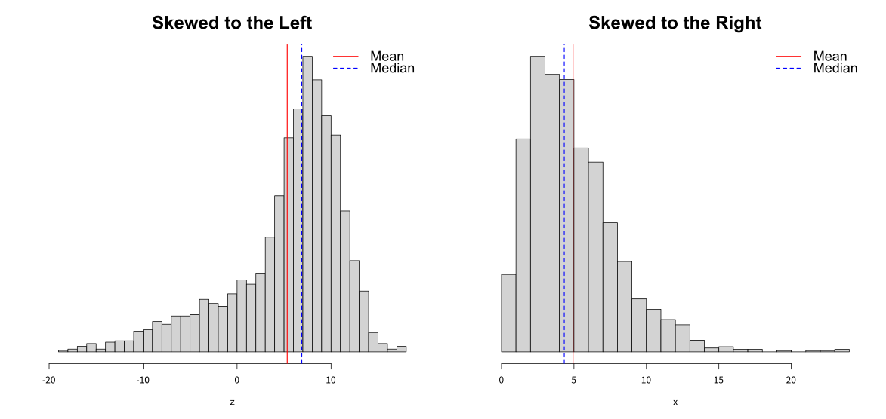
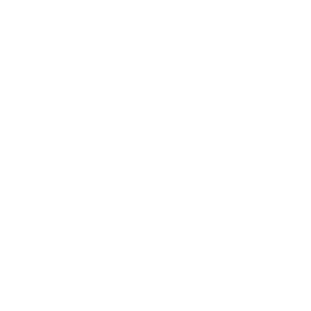

```{r setup-knitr, include=FALSE}
options(htmltools.dir.version = FALSE)
# knitr::opts_knit$set(root.dir='..')
knitr::opts_chunk$set(eval = TRUE, 
                      echo = FALSE, 
                      cache = FALSE,
                      include = TRUE,
                      collapse = FALSE,
                      message=FALSE,
                      warning=FALSE, 
                      dependson = NULL,
                      engine = "R", # Chunks will always have R code, unless noted
                      error = TRUE,
                      fig.path="Figures/",  # Set the figure options
                      fig.align = "center", 
                      #fig.width = 7,
                      #fig.height = 7, 
                      fig.keep='all', fig.retina=3)

```

```{r setup-library}
library(MASS)
library(reshape2)
library(plyr)
library(tidyverse)
library(lubridate)
library(readxl)
library(tidyselect)
library(tidystats)
library(glue)
library(here)
library(gt)
library(gtsummary)
library(kableExtra)

```


class: inverse, center, middle


# How to Explore (Describe) Data by Number? `r emo::ji("zoom")` `r icons::fontawesome("sort-numeric-down", style = "solid")`

---
# Measures of Location `r icons::fontawesome("location-arrow", style = "solid")`

## Where is the center? 

### **Sample mean**: often called the average, arithmetic mean 

Consider the sample $X_1, \ldots, X_n$ drawn from a population $X$. Its **sample mean** is given by 


$$
\bar{X} = \frac{1}{n}\sum_{i=1}^{n} X_i = \frac{1}{n} (X_1 + \cdots, +X_n)
$$


> - Example: calculate the mean of five numbers $\{6.5, 6, 5.5, 7.5, 8\}$


$$
\bar{X} = \frac{1}{5} (6.5 + 6 + 5.5 + 7.5 + 8) = 6.7
$$

> Question: is $\bar{X}$ a random variable?


--
#### **Answer**: **Yes** $\rightarrow$ Then what characteristic have?


???

The most basic question to ask of any dataset is ‘What is the typical value?’ 

There are several ways to answer that question and they should be familiar to most students.

**Sample mean** is the first, and probably the most important, example of statistic. 

The importance of the sample mean $\bar{X}$ comes from its use in drawing conclusions about 
the population mean $\mu = E(X)$. Some of the most frequently used inferential procedures are based on 
properties of the sampling distribution of $\bar{X}$.

Since $\bar{X}$ is a random variable, we often are interested in its expectation, variance 
and probability distribution (a.k.a. sampling distribution).

In physics, the expectation holds the same meaning as the center of gravity. 
The distribution can be represented by a series of weights at each outcome, and the mean represents the balancing point.

---
# Measures of Location `r icons::fontawesome("location-arrow", style = "solid")`

## Where is the center? 


```{r, out.width="70%", fig.align='center'}
knitr::include_graphics("assets/imgs/mean-viz.gif")
```

.center[[**Illustration of the physical characteristics of the sample mean**](http://statisticsbypeter.blogspot.com/2014/05/arithmetic-mean.html)]

---
# Measures of Location `r icons::fontawesome("location-arrow", style = "solid")`

## Where is the center? 

###  Example: calculate the sample mean


.pull-left[
```{r, echo=TRUE}
# show the first 6 rows
head(cars)

```
]

.pull-right[
```{r, echo = TRUE}
# show data summary results
summary(cars)
```
]

Sample mean for a specific variable

```{r echo = TRUE}
# generic function to calculate the sample mean
barx <- mean(cars$speed); barx
```


---

# Measures of Location `r icons::fontawesome("location-arrow", style = "solid")`

## What value exactly split data in half? `r icons::fontawesome("star-half-alt", style = "solid")`

### **Sample Median**: The middlemost observation in the ordered data 

> - when the size of data is even, the meadian becomes the mean of the two middlemost value. 

### Calculation of the median value (simple examples)

>- Suppose we have 5 observations $\{6, 2, 4, 3, 8 \}$
>   - Ordering: $\{6, 2, 4, 3, 8 \} \rightarrow \{2, 3, 4, 6, 8 \}$ 
>   - Median value: 4


>- Suppose we have 6 observations $\{10, 2, 6, 5, 4, 2 \}$
>   - Ordering: $\{10, 2, 6, 5, 4, 2 \} \rightarrow \{2, 2, 4, 5, 6, 10 \}$ 
>   - Median value: $(4 + 5)/2 = 4.5$


---

# Measures of Location `r icons::fontawesome("location-arrow", style = "solid")`

## What value exactly split data in half? `r icons::fontawesome("star-half-alt", style = "solid")`


```{r, out.width="70%", fig.align='center'}

```

.center[[**Illustration of deriving sample median**](http://statisticsbypeter.blogspot.com/2014/05/median.html)]


---
# Measures of Location `r icons::fontawesome("location-arrow", style = "solid")`

## What value exactly split data in half? `r icons::fontawesome("star-half-alt", style = "solid")`

###  Example: calculate the sample median

> using `median()` function


```{r, echo=TRUE, results='hold'}
median(cars$speed)
median(cars$dist)
```


### CHECK

#### The median value is more **robust** than the sample mean. 


--
## WHY?? $\rightarrow$ describe a plausible explanation for the homework next week!!


---

# Measures of Location `r icons::fontawesome("location-arrow", style = "solid")`

## What values frequently occur in your data? 

### Mode: peak(s) in the distribution of data 

> - two or more items have the highest occurrence, they are all the mode
> - each value occurs equally $\rightarrow$ no mode

### Peaks (modes) can be multiple

.center[]


---
# Measures of Location `r icons::fontawesome("location-arrow", style = "solid")`

## What values frequently occur in your data? 

- The **mode** is not often used but helps a nice description of data
- When plotting a histogram of the multimodal data (continuous), the mode is affected by the choice of bins. 

### Normal mixture (trimodal)

.center[]


---
# Measures of Location `r icons::fontawesome("location-arrow", style = "solid")`

## What values frequently occur in your data? 

### What if too many bins were used to the histogram for an unimodal distribution? 


.center[]


---
# Measures of Spread `r icons::fontawesome("people-arrows", style = "solid")` 

## How is the range of data? `r icons::fontawesome("exchange-alt", style = "solid")`

**Range**: distance from the largest (maximum) to the smallest (minimum) value in the data

> - highlt affected by a single extreme value

```{r, echo=TRUE}
r <- diff(range(cars$speed)); r # calculate range of a single variable
```

**Inter-Quartile Range (IQR)**: a distance b/w 25<sup>th</sup> and 75<sup>th</sup> percentile (used in the **BOXPLOT**)

> - $p^{th}$ percentile: In ordered data, the obs. that has at most $p$ percent of the obs. below it and $1-p$ above it ( $0 \leq p \leq 100$ )
> - median: 50<sup>th</sup> percentile

####  Example: calculate IQR

.pull-left[
```{r, echo = TRUE}
iqr <- IQR(cars$dist) # calcuate IQR
iqr_check <- quantile(cars$dist, 0.75) - quantile(cars$dist, 0.25)
```
]

.center[
```{r}
icons::fontawesome("arrow-right", style = "solid")
```

]


.pull-right[
```{r, prompt=NA, comment=NA}
c(iqr_fun = iqr, iqr_quantile = iqr_check)
```
]

---
# Measures of Spread `r icons::fontawesome("people-arrows", style = "solid")` 

### How spread is the data from the (sample) mean? 

### **Sample Variance**

> the **average distance** of the observation to the **mean**

Let's consider the $i^{th}$ **deviation** $\rightarrow$ difference (distance) from the sample mean

$$e_i = x_i - \bar{x} $$
### Mean of deviation is always 0!! See

--


$$\sum_{i=1}^{n}(x_i - \bar{x}) = \sum_{i=1}^{n}x_i - \sum_{i=1}^{n}\bar{x} = n\frac{1}{n}\sum_{i=1}^{n}x_i - n\bar{x} = n\bar{x} - n\bar{x} = 0$$ 

--

### How to solve?? 

--

> - Taking absolute $|e_i|$ or square $e_i^2$ $\rightarrow$ $e_{i}^2$ is more appropriate $\rightarrow$ **WHY??**


???


The big problem is that about half the deviates are negative and the others are positive. 
What we really care is the distance from the mean, not the sign. So we could either take the absolute value, or square it.

There are some really good theoretical reasons to chose the square option. 
Squared terms are easier to deal with computationally when compared to absolute values. 
More importantly, the spread of the normal distribution is parameterized via squared distances from the mean. 
Because the normal distribution is so important, we’ve chosen to define the sample variance so it matches up with 
the natural spread parameter of the normal distribution. 
So we square the deviations and find the average deviation size (approximately) and call that the sample variance.


---

# Measures of Spread `r icons::fontawesome("people-arrows", style = "solid")` 

### How spread is the data from the (sample) mean? 

### **Sample Variance** is defined as 

$$\hat\sigma^2 = s^2 = \frac{1}{n-1}\sum_{i=1}^{n} (x_i - \bar{x})^2 $$

### Why divided by $n-1$ instead of $n$ ?

> - underestimate the population variance $\sigma^2$
> - If the true mean (population mean) is known, the equation of variance is 

$$\sigma^2 = \frac{1}{n}\sum_{i=1}^{n} (x_i - \mu)^2 $$


> - We use an estimates of population mean $\bar x$ for the estimation of the $\sigma^2$ $\rightarrow$ using one **degree of freedom**<sup>*</sup> 

 
.footnote[[*] the number of values in the final calculation of a statistic that are free to vary.]


???


The number of independent pieces of information that go into the estimate of a parameter are called the degrees of freedom. 
In general, the degrees of freedom of an estimate of a parameter are equal to the number of independent scores 
that go into the estimate minus the number of parameters used as intermediate steps in the estimation of the parameter itself 
(most of the time the sample variance has N − 1 degrees of freedom, 
since it is computed from N random scores minus the only 1 parameter estimated as intermediate step, which is the sample mean).


---

# Measures of Spread `r icons::fontawesome("people-arrows", style = "solid")` 

### How spread is the data from the (sample) mean? 

#### Calculating the sample variance by hand

> - data: 3, 6, 2, 4, 7 $\rightarrow$ $\bar x$ = `r mean(c(3, 6, 2, 4, 7))`


```{r}
xi <- c(3, 6, 2, 4, 7); mx <- mean(xi)
dev <- xi - mx
devsq <- dev^2
summ <- c("\\(\\sum\\)", 0, sum(devsq))
tab <- tibble(`\\(x_i\\)` = xi, 
              `\\(x_i - \\bar x\\)` = dev, 
              `\\((x_i - \\bar x)^2\\)` = devsq) %>% 
  mutate_all(as.character)
tab <- rbind(tab, summ)
tab %>% 
  kableExtra::kbl(format = "html", 
      align = "ccc", 
      escape = "FALSE", 
      booktabs = TRUE, 
      caption = "Calculation of the Sample Variation") %>% 
  kableExtra::kable_paper(bootstrap_options = "condensed", 
                          font_size = 15) %>% 
  kableExtra::row_spec(6, bold = T) 


```

the sample variance is


$$s^2 = \frac{17.2}{n -1} = \frac{17.2}{4} = 4.3$$


---

# Measures of Spread `r icons::fontawesome("people-arrows", style = "solid")` 

### How spread is the data from the (sample) mean? 

.pull-left[

####  Example: calculate the sample variance

```{r, echo=TRUE, comment=NA}
# calculate sample variance
xi <- c(3, 6, 2, 4, 7)
var(xi)

```


```{r, echo=TRUE, comment=NA}
# Calculate sample variance in iris dataset
data(iris)
apply(iris[, 1:3], 2, var)

```

]


.pull-right[

The problem of the sample variance $\rightarrow$ **unit**

The simple solution $\rightarrow$ taking $\sqrt{~~~}$

**Standard deviation**

$$s = \sqrt{s^2} = \sqrt{\frac{1}{n-1}\sum_{i=1}^n(x_i - \bar x)^2}$$
####  Example: calculate SD

```{r, echo=TRUE, comment=NA}
apply(iris[,1:3], 2, sd)
```

]


---

# Measures of Spread `r icons::fontawesome("people-arrows", style = "solid")` 

### How spread is the data from the (sample) mean? 

> For any data distributed approximately normal distribution, emprically 


```{r sd-rule, fig.width=8, fig.height=8, out.width="55%", dev='svg'}
c(expression(paste(bar(x) - 3*s)), expression(paste(bar(x) -2*s)), 
  expression(paste(bar(x) - s)), expression(paste(bar(x))), 
  expression(paste(bar(x) + s)), expression(paste(bar(x) + 2*s)), 
  expression(paste(bar(x) + 3*s))) -> xlab1

xlab2 <- c(expression(paste(bar(x) %+-% s)), 
           expression(paste(bar(x) %+-% 2*s)), 
           expression(paste(bar(x) %+-% 3*s)))
xlab3 <- c("68%", "95%", "99%")

x <- seq(-4, 4, by = 0.01)
z <- dnorm(x)

par(mfrow = c(3, 1))
for (i in 1:3) {
plot(x, z,
     type = "n",
     bty = "n",
     xlab = "", 
     ylab = "",
     xaxt = "n",
     yaxt = "n", 
     main = paste(i, "Standard Deviation"), 
     cex.main = 2)
idx <- x > -i & x < i
polygon(c(-i, x[idx], i), 
        c(0, z[idx], 0), 
        col = "gray", border = "gray")
lines(x, z, lty = 1, lwd = 2)
axis(1, at = seq(-3, 3, by = 1), 
     labels = xlab1)
text(0, 0.2, xlab2[i], adj = 0.5, cex = 1.5, pos=3)
text(0, 0.2, xlab3[i], adj = 0.5, cex = 1.5, pos=1)
}


```


---
# Measures of Spread `r icons::fontawesome("people-arrows", style = "solid")`

## How data spread relatively? 

### Coefficient of Variation (relative standard deviation)

> - Variance is generally proprotional to the mean value
> - The absolute value of the variance in the size of elephants is always larger than beetles. 
> - Within each animal, 
>   - variance in elephants: dramatically small
>   - variance in beetles: dramatically large 
> - **Compare the variance between groups (or variables) that have a great difference in the mean value**

Coefficient of variation (CV) is defined as 

$$CV = \frac{s}{|\bar x|} $$

---
# Measures of Spread `r icons::fontawesome("people-arrows", style = "solid")`

## How data spread relatively? 

### Coefficient of Variation (relative standard deviation)


####  Example: calculate CV

.pull-left[

```{r, echo=TRUE}
# mtcars dataset
data(mtcars)
mx <- sapply(mtcars[,c(1, 3, 4)], mean)
sx <- sapply(mtcars[,c(1, 3, 4)], sd)
cv <- sx/abs(mx)
```
]

.pull-right[
```{r, comment=NA}
sx; cv
```

]

####  Example: calculate CV (groups)

.pull-left[

```{r, echo=TRUE}
mx_c <- aggregate(mtcars[, "disp"], by = mtcars["cyl"], mean)
sx_c <- aggregate(mtcars[, "disp"], by = mtcars["cyl"], sd)
cv_c <- cbind(cyl = mx_c$cyl, cv = sx_c$x/abs(mx_c$x))

```

]

.pull-right[

```{r, comment=NA}
cv_c
```

]


#### **Note**: the reciprocal of CV often called as "**signal-to-noise ratio**"


<!-- --- -->

<!-- # Measure of Association `r icons::fontawesome("link", style = "solid")`  -->

<!-- ## How is the relationship between  two variables?  -->


---
class: inverse, center, middle


# How to Explore (Describe) Data Graphically? `r emo::ji("zoom")` `r icons::fontawesome("photo-video", style = "solid")`


---
# Shape of Data `r icons::fontawesome("shapes", style = "solid")`

### Symmetry

> - There exist the point on the x-axis (called as $\mu$) that acts as mirror 
> - mathmatically, $f(-|x - \mu|) = f(|x - \mu)$


#### **Example of Symmetric Distribution**

.center[]


not symmetric $\rightarrow$ asymmetric distribution

---

# Shape of Data `r icons::fontawesome("shapes", style = "solid")`

### Skewed 

> - a ditribution has a heavier tail on one side or the other $\rightarrow$ **skewed distribution**


.center[]


---
# Barplot `r icons::fontawesome("chart-bar", style = "solid")`

### Useful to display univariate data about a groups

> - Better than piechart $\rightarrow$ easy to compare groups
> - x: categorical variable; y: numerical or counting

####   **Example**: a barplot of counting by groups $\rightarrow$ `warpbreaks`dataset


.pull-left[

```{r, echo=TRUE, comment=NA}
# counting the number of breaks 
# by wool and tension groups
count <- with(warpbreaks, 
              tapply(breaks, 
                     list(wool, tension), 
                     sum))
count
```

**NOTE**: **DO NOT REMOVE 0 on Y-AXIS**

]


.pull-right[

```{r barplot-example, dev='svg', out.width="90%"}
barplot(count, legend = TRUE, beside = TRUE, 
        xlab = "Tension", 
        ylab = "Number of breaks", 
        ylim = c(0, 450), 
        cex.lab = 1.5) # 분리 형태
```


]


???


barplot(count, legend = TRUE, beside = TRUE, 
        xlab = "Tension", 
        ylab = "Number of breaks", 
        ylim = c(0, 450), 
        cex.lab = 1.5) # 분리 형태
        
        

---
# Histogram 

### For a continuous variable, 

> - Very similar to a bar plot, but is used to represent numerical data (not categorical data)
> - x: original variable $\rightarrow$ what happen to draw without making bins (groups)?
>   - Bin: segmented intervals for the original data
>   - Example: range of height (150 to 190) $\rightarrow$ 150 ~ 155, 156 ~ 160, ...
> - y: frequency or count
> - a rescale version of y called "**density**" $\rightarrow$ making total area sum to 1


$$d_{i} = \frac{n_{i}}{N} \cdot \frac{1}{w}, ~ i=\{1, 2, \ldots, k \}$$


> - $d_i$: density of $i^{th}$ bin
> - $n_i$: number of obs. in the $i^{th}$ bin
> - $N$: total number of data
> - $w$: width of a bin


---

# Histogram 

###  Example: making histogram 

.pull-left[

**Frequency**

```{r, echo=TRUE, dev='svg'}
data(iris)
hist(iris$Sepal.Length)

```

]

.pull-right[

**Density**

```{r, echo=TRUE, dev='svg'}
# use option
hist(iris$Sepal.Length, freq = FALSE)
```


]

---

# Boxplot 

### Depicting groups of numerical data by Five numbers 

.center[]


> - categorical vs. continuous variable
> - the edges of the box: the range between **25%** $(Q_1)$ and **75% percentile** $(Q_3)$ $\rightarrow$ inter-quartile range (IQR)
> - a line inside of the box: 50% percentile $\rightarrow$ **median**
> - horizontal lines outside of the box: $Q_1 - 1.5\times\mathrm{IQR}$ (lower direction), $Q_3 + 1.5\times\mathrm{IQR}$ (upper direction)
> - points: potential outliers: the lowest points (**minimum**); the largest point (**maximum**)


---

# Boxplot 

###  Example 

.pull-left[

```{r boxplot-example, echo=TRUE, comment=NA, out.width="80%", dev='svg'}
data(iris)
#head(iris) # check data
# summary(iris) # summarize data
boxplot(Sepal.Length ~ Species, data = iris, 
        main = "Boxplot: Sepal Length by Species")

```
]


.pull-right[


```{r histogram-iris-01, echo=TRUE, comment=NA, out.width="80%", dev='svg'}
# Histogram
par(mfrow = c(3, 1)) 
for (i in levels(iris$Species)) { hist(iris$Sepal.Length[iris$Species == i], 
       xlim = c(4, 8), xlab = i, breaks = 10, 
       main = paste("Histogram of Sepal length:", i))}
  

```

]


---

# Scatterplot  


### Relationship between two numerical variables 

> - Very useful to examine the pattern between two variables


###  Example: `iris` dataset

.pull-left[

```{r, echo=TRUE, eval=FALSE}
# Scatterplots with groups
shapes <- 15:17
plot(Petal.Length ~ Sepal.Length, 
     data = iris,
     type = "n",
     bty = "n",
     main = "Scatterplot between petal length and petal length")
points(iris$Sepal.Length,
       iris$Petal.Length,
       pch = shapes[as.numeric(iris$Species)], # 각 Species에 대해 shapes 할당
       col = as.numeric(iris$Species),
       cex = 1.5)
```

]


.pull-right[
```{r, out.width="100%", fig.align='center'}

```

]


