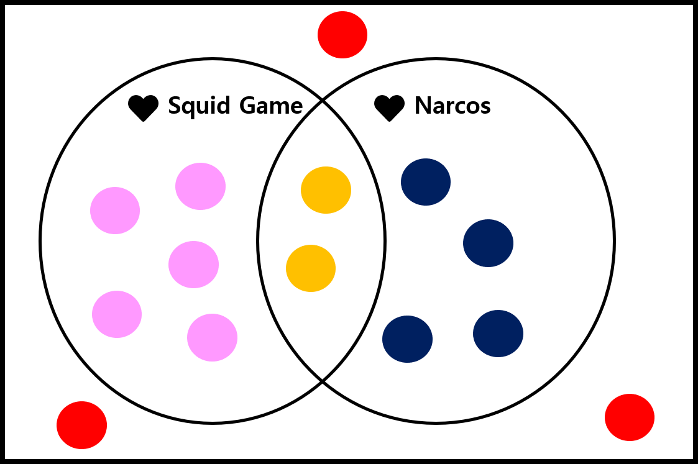
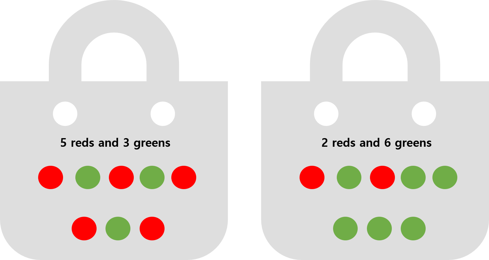

```{r setup-knitr, include=FALSE}
options(htmltools.dir.version = FALSE)
# knitr::opts_knit$set(root.dir='..')
knitr::opts_chunk$set(eval = TRUE, 
                      echo = FALSE, 
                      cache = FALSE,
                      include = TRUE,
                      collapse = FALSE,
                      message=FALSE,
                      warning=FALSE, 
                      dependson = NULL,
                      engine = "R", # Chunks will always have R code, unless noted
                      error = TRUE,
                      fig.path="Figures/",  # Set the figure options
                      fig.align = "center", 
                      #fig.width = 7,
                      #fig.height = 7, 
                      fig.keep='all', fig.retina=3)

```

```{r setup-library}
library(MASS)
library(reshape2)
library(plyr)
library(tidyverse)
library(lubridate)
library(readxl)
library(tidyselect)
library(tidystats)
library(glue)
library(here)
library(gt)
library(gtsummary)
library(kableExtra)
library(icons)

xaringanExtra::use_tile_view()
xaringanExtra::use_progress_bar(color = "#23373B", location = "bottom")
xaringanExtra::use_scribble()


```


<!-- class: inverse, center, middle -->


# Probability `r icon_style(fontawesome("dice", style = "solid"), fill = "white")`

---


# Random vs. Deterministic

### Deterministic Experiment 

> The outcome can be predicted with certainty beforehand

#### **Example**

> - Chemical/physical experiment (e.g. $\mathrm{2H + O = H_2O}$, $S = 0.5gt^2$)
> - Adding two numbers (e.g. 8 + 3 = 11)


### Random Experiment 

> The outcome is determined by chance and cannot be predicted with certainty beforehand


#### **Example**

> - Tossing/rolling a coin/dice $\rightarrow$ $\{H, T\}$ or $\{1,2,3,4,5,6\}$
> - throwing a dart on a board
> - A LOTTO/Hitting the jackpot


**Random phenomena**: outcomes of the random experiment


???

Experiments can be categorized into two types: deterministic experiment and random experiment. 

A **deterministic experiment** is one whose outcome may be predicted with certainty beforehand. 

Experiments in the field of chemistry and physics are typical examples of the deterministic experiments. 

For example, when 2 hydrogens are combined with an oxygen, it must result water H2O. 

Or when adding two numbers such as 8 and 3, it becomes 11 not 10 or 12. 

Meanwhile, the random experiment is one whose outcome is determined by chance. 

That is, we assume that 


---


# Sample Space 

> #### **All possible outcomes of a random experiment** $\rightarrow$ $S$

#### Example 

> - Tossing a coin: $S = {H, T}$
> - Rolling a dice:  $S$={`r fontawesome("dice-one", style = "solid")`, `r fontawesome("dice-two", style = "solid")`, 
`r fontawesome("dice-three", style = "solid")`, `r fontawesome("dice-four", style = "solid")`, 
`r fontawesome("dice-five", style = "solid")`, `r fontawesome("dice-six", style = "solid")`} = {
1, 2, 3, 4, 5, 6}


### $S$ can be _finite_ or _infinite_

> - #### **Finite sample space**: $S = \{e_1, e_2, \ldots, e_N\}$ 


> - #### **Infinite sample space** <br><br>
> 
>   - Natural numbers: $\{1, 2, \ldots\}$ $\rightarrow$ **countably infinite sample space** $\rightarrow$ 
**_discrete sample space_**
>   - Many numbers within an interval (e.g. $0\leq x \leq 1$) $\rightarrow$ 
**non-countably infinite sample space** $\rightarrow$ **_non-discrete sample space_**


**In terms of statistics, sampling is a observation of an outcome from the random experiment and its result is called as a sample**


???


---

# `r fontawesome::fa("r-project", fill = "white")` Practice: Sample Space

#### Making a function to create a sample space for simple tools of random experiments (coin and dices)

.pull-left[
```{r, echo=TRUE}
sample_space <- function(
  outcome, times, prob = FALSE
) {
  n <- length(outcome)
  temp <- list()
  for (i in 1:times) {
    temp[[i]] <- outcome
  }
  out <- expand.grid(
    temp, 
    KEEP.OUT.ATTRS = FALSE
  )
  names(out) <- paste(
    "X", 1:times, sep = ""
  )
  if (prob) 
    out$probs <- rep(1, n^times)/(n^times)
  return(out)
}

```
]


.pull-right[
#### rolling a dice once

```{r, echo=TRUE, comment=NA}
sample_space(1:6, times = 1) |> unlist()

```


#### Toss a coin 3 times (all sample space)

```{r, echo=TRUE, eval=FALSE}
sample_space(c("H", "T"), 3)
```

$\rightarrow$ **CHECK RESULTS**


Please check Kerns, G. Jay. Introduction to probability and statistics using r. Lulu. com, 2010.

]


---

# Events

### **A collection of outcomes $\rightarrow$ a subset of the sample space**

> If outcomes of the random experiment belong to the event $A$ $\rightarrow$ the event $A$ has **_occurred_**. 

#### A single event of $A$ $\rightarrow$ a **_simple_** or **_elementary event_** (See pp. 4)

#### Special Events (Basic Set Operation)

> - $S$: Sample space itself $\rightarrow$ _sure_ or _certain event_ (any element of $S$ must occur) 
> - $\varnothing$: **Empty set**, _impossible, empty, or null event_
> - A event occurs **either $A$ or $B$ or both** $\rightarrow$ $A\cup B$ (**_union_** of $A$ and $B$)
> - **both $A$ and $B$** $\rightarrow$ $A\cap B$ (**_intersection_** of $A$ and $B$)
> - The event "**not $A$**" $\rightarrow$ $A^c$ or $A'$ (**_complement_** of $A$)
> - The event " $A$ **but not $B$**" $\rightarrow$ $A - B$ or $A \cap B^c$ (**_set difference_**)
> - a bunch of events $A_1, A_2, A_3, \ldots$ are _mutually exclusive_ or _disjoint_ if $A_i\cap A_j = \varnothing$, 
where $A_i \neq A_j$


**To review the set algebra, see Appendix E.1 in `IPSUR.pdf`**

---

# `r fontawesome::fa("r-project", fill = "white")` Practice: Events

.pull-left[
#### all three coins show identical faces

```{r, echo=TRUE, comment=NA}
S <- sample_space(c("H", "T"), times = 3)
subset(S, X1 == X2 & X1 == X3 & X2 == X3)

```

#### show 2 heads when tossing a coin 3 times

```{r, echo=TRUE, comment=NA}
count <- apply(S, 1, function(x) as.numeric(x == "H"))
numH <- apply(count, 2, sum)
S[which(numH == 2), ]

```

]

.pull-right[
#### more than 2 times of `r fontawesome("dice-three", style = "solid")` rolling 3 dices

```{r, echo=TRUE, results='hide'}
S <- sample_space(1:6, 3)
count <- apply(S, 1, function(x) as.numeric(x == 3))
num3 <- apply(count, 2, sum)
S[which(num3 >= 2), ]

```

#### sum of all three dices are more than 16

```{r, echo=TRUE, comment=NA}
subset(S, X1 + X2 + X3 > 16)
```

]

---

# Concept of Probability


#### **A measure of the chance or uncertainty that assigns a number between 0 to 1**

> - Sure or certain that a event will occurs $\rightarrow$ probability is 100% or 1
> - Sure or certain that a event will not occurs $\rightarrow$ probability is 0 
> - Probability is 1/4 $\rightarrow$ a 25% chance will occur and a 75% chance will not occur
> - Odds against occurance are 75% to 25%, 3 to 1, odds = 1/3


#### **Theoretical Probability**

> - Define a mathemetical function on the sample space $\rightarrow$ probability measure
> - $h$ different ways out of a total of $n$ possible ways $\rightarrow$ 
the probability is $h/n$ (all of outcomes are equally likely)


#### **Emperical Probability**

> With $n$ repetition, $h$ times of occurance were observed $\rightarrow$ the probability is $h/n$ 
(when $n \rightarrow \infty$)


???

For example, tossing a coin repeatedly, in exactly the same way each time. 

Keep a record of total trials and the number of heads observed 

$$P(\mathrm{Heads}) \approx \frac{\mathrm{total~\#~of~flips}}{\mathrm{\#~of~observed~head}}$$
The mathematical background of this approach is the Law of Large Numbers. 

Let $S_n$ count the number of times that $A$ occurred in the $n$ experiments 

$$\frac{S_n}{n} \rightarrow P(A),~ n \rightarrow \infty$$

As the reasoning goes, to learn about the probability of an event A we need only repeat the

random experiment to get a reasonable estimate of the probability’s value, and if we are not

satisfied with our estimate then we may simply repeat the experiment more times all the while

confident that with more and more experiments our estimate will stabilize to the true value.

The frequentist approach is good because it is relatively light on assumptions and does not

worry about symmetry or claims of objectivity like the measure-theoretic approach does. It is

perfect for the spinning coin experiment. One drawback to the method is that one can never

know the exact value of a probability, only a long-run approximation. It also does not work

well with experiments that can not be repeated indefinitely, say, the probability that it will rain

today, the chances that you get will get an A in your Statistics class, or the probability that the

world is destroyed by nuclear war.

---

# Axioms of Probability

> Suppose $S$ is a sample space and each event $A$ of the $S$, $P(A) = p$ called the probability of $A$ 
and satisfies the following axioms: 


- **Axiom 1**: For any event $A \subset S$, $P(A) \geq 0$

- **Axiom 2**: For the sure or certain event $S$, $P(S) = 1$

- **Axiom 3**: If the events $A_1, A_2, A_3, \ldots$ are disjoint (mutually exclusive) events, 


$$P(A_1 \cup A_2 \cup \ldots) = P\left(\bigcup_{i=1}^{\infty} A_i \right) = P(A_1) + P(A_2) + \cdots = \sum_{i=1}^{\infty}P(A_i)$$


???

The intuition behind the axioms: first, the probability of an event should never be negative.

And since the sample space contains all possible outcomes, its probability should be one, 

or 100%. The final axiom may look intimidating, but it simply means that for a sequence of

disjoint events (in other words, sets that do not overlap), their total probability (measure) should

equal the sum of its parts. For example, the chance of rolling a 1 or a 2 on a die is the chance of

rolling a 1 plus the chance of rolling a 2.


---

# Properties of Probability

#### **Some important theroems related to probability**

- **Theorem 1**: If $A \subset B$ then $P(A) \leq P(B)$

- **Theorem 2**: For avery event $A$, $0 \leq P(A) \leq 1$

- **Theorem 3**: For $\varnothing$, $P(\varnothing) = 0$

- **Theorem 4**: $P(A^c) = 1 - P(A)$

- **Theorem 5**: **_The general addition rule_**

$$\begin{aligned}
P(A\cup B) &= P(A) + P(B) - P(A\cap B)~~~\mathrm{more~generally,}\\
P\left(\bigcup_{i=1}^{n}A_i\right) &= \sum_{i=1}^{n}P(A_i) - \sum_{i=1}^{n-1}\sum_{j=i+1}^{n}P(A_i\cap A_j) +\cdots + (-1)^{n-1}P\left(\bigcap_{i=1}^{n}A_i\right)\end{aligned}$$

- **Theorem 6**: Let $B_1, B_2, \ldots, B_n$ be disjoint and partitioned in $A$

$$P(A) = P(A\cap B_1) + P(A\cap B_2) + \cdots + P(A\cap B_n)$$

$\rightarrow$ **The Theorem of Total Probability**

???

Theorem 1 _Proof_. If $A\subset B$, it suffices  $B = A \cap (B\cup A^c)$ and $A\cap (B\cap A^c)=\varnothing$, 
therefore, $P(B) = P(A \cap (B\cup A^c)) = P(A) + P(B\cup A^c)\geq P(A)$

Theorem 3 _Proof_. $\varnothing$ = $S^c$


---

# Assignment of Probabilities

#### If $S$ consists of outcomes $a_1, a_2, \ldots, a_n$ that are **equally likely** in the sense ( $a_{i}\cap a_{j} = \varnothing$ ) that each $a_i$ has equal chance of occurance, by Axiom 2 and 3 

$$P(S) = P(\{a_1, a_2, \ldots, a_n\})=P(a_1\cup a_2 \cup \ldots\cup a_n) = \sum_{i=1}^{n}P(a_i) = 1$$

> #### Since $P(a_i)$ is identical for all $i$, $P(a_i) = 1/N$


#### For an event $A \subset S$ with $k$ elements: e.g. $A=\{a_{i1}, a_{i2}, \ldots, a_{ik}\}$

$$\begin{aligned}
P(A) &= P(a_{i1}) + P(a_{i2}) + \cdots + P(a_{ik}) \\
     &= \frac{1}{N} + \frac{1}{N} + \cdots + \frac{1}{N} \\
     &= \frac{k}{N} = \frac{\#(A)}{\#(S)}
\end{aligned}$$

### $\rightarrow$ Equally Likely Model (ELM) 

> - _equivalent to the theoretical definition of the probability_
> - convenient and popular way to analyze the random experiments


---

# Counting Method

#### Calculate the probability of occurance of the event $A$ $\rightarrow$ just merely **COUNTING** the number of possible outcomes of $A$ and $S$

### Multiplication Rule 

#### Suppose the experiment consisting of two successive steps

- $n_1$: The number of distinct ways for the first step
- $n_2$: The number of distinct ways for the second step

> - **All possible way made by two steps** $\rightarrow$ $n_1 n_2$ ways

#### More generally 

> An experiment composed of $k$ successive steps with $n_1, n_2, \ldots, n_k$ ways, respectively, 
then all possible number of outcomes from an experiment is $n_1 n_2 \cdots n_k$


#### **EXAMPLE** 

> - Pizza topping: {pepperoni, sausage, anchovies, olives, green peppers}
> - Total number of available topping: $2\cdot 2\cdot 2\cdot 2\cdot 2 = 2^5 = 32$


---

# Counting Method

### Permutations 

> Counting the number of different **arrangements**

$$_nP_r = n(n-1)\cdots(n-r+1)$$

> **_the number of permutations of $n$ objects taken $r$ at a time_**

#### A bag with $n$ distinguishable balls and draw $r$ balls at random. How many possible sequences might be observed? 

- **with replacement**: $n^r$
- **without replacement**: $n(n-1)(n-2)\cdots(n-r + 1)$

#### **EXAMPLE**

Required to seat 5 men and 4 women in a row so that the women occupy the even places

> - The men: $_5P_5 = 5! = 120$
> - the women: $_4P_4 = 4! = 24$
> - $\therefore$ number of arrangements = $120 \times 24 = 2880$


???

The number of permutations of $n$ elements is $n!$


---

# Counting Method

### Combinations

> - A counting method for selected objects **without regard to order and replacement**
> - _combinations of $n$ things taken $r$ at a time_ $\rightarrow$ $_nC_r$

$$_nC_r = {n \choose r} = \frac{n!}{r!(n-r)!}$$
It can be written 


$$_nC_r = {n \choose r} = \frac{n(n-1)\cdots(n-r+1)}{r!} = \frac{_nP_r}{r!}$$

> - Permutations $\rightarrow$ interesting in order of arrangements (e.g. $\{abc\} \neq \{cba\}$)
> - In combinations, $\{abc\} = \{cba\}$

#### **EXAMPLE**

> From 7 consonant and 5 vowels, how many words can be formed consisting of 4 different consonants 
and 3 vowels? 


---

# Conditional Probability

#### **Concept** 

- Suppose select two cards from a full deck of 52 standard cards in succession. 

> - Event $A$: the first card is Ace
> - Event $B$: the second card is Ace

- $P(A)=4/52$ ( $\therefore$ Four Aces)
- (1) If the first card is Ace, then $P(B) = 3/51$ (The sample space is **changed!!**)
- (2) If the first card is **NOT** Ace, then $P(B) = 4/51$

$$(1):~P(B|A) = 3/51, ~~~ (2):~P(B|A^c)=4/51$$

> _When the sample space is changing, then the probability defined on the sample space is also changing_


#### Under the condition that some information (event) was revealed (occurred), then what does the probability of the other event (usually related to the previous information) occur? 

$\rightarrow$ The probability that the main event $(B)$ occur given that the previous event $(A)$ occur? 

---

# Conditional Probability 

#### **Definition**

> Let $A$ and $B$ two events such dat $P(A) > 0$. Denote $P(B|A)$ the probability of $B$ given that 
$A$ has occurred is defined by 

$$P(B|A) = \frac{P(A\cap B)}{P(A)}, ~~~ P(A) > 0$$

#### _Example_

UST students in KIOM, I asked them which NETFLIX series is the most favorite: 

- Squid Game vs. Narcos: one of them or both or none

.center[
 vs. 


]


---

# Conditional Probability

.pull-left[
#### Suppose 14 UST students in KIOM

> - love Squid Game: 7 
> - love Narcos: 6 
> - love both: 2 
> - don't like both: 3
]

--
.pull-right[
####    

```{r, echo=FALSE}
# library(gt)
x1 <- c(2, 4)
x2 <- c(5, 3)
t1 <- tibble(
  rowname = c("Love S.G", "Not like S.G"),
  `Love NC` = x1,
  `Not like NC` = x2
)

kbl(t1, booktabs = TRUE, caption = "Contingency Table") %>% kable_paper %>% kable_styling(font_size = 14)
```
]
<br>

--

.pull-left[
#### **Venn Diagram**

]


--
#### **Probabilities**

- Let $A$ and $B$ be the events that students like Squid Game and Narcos, respectively.
- $P(A) = 7/14$, $P(B) = 6/14$
- $P(A\cap B) = 2/14$

--

**NOW LET'S CALCULATE CON'D PROBABILITIES!!**


---

# Conditional Probability

> #### Remind the contingency table and venn diagram!!

- The probability that students love S.G among students who love Narcos? 

--

$$P(A|B) = P(\mathrm{love~S.G~and~NC|loves~NC}) = \frac{P(A\cap B)}{P(B)} = \frac{2/14}{6/14}=\frac{1}{3}$$
- The probability that students don't like S.G among students who don't like Narcos? 

--

$$P(A^c|B^c) = \frac{P(A^c\cap B^c)}{P(B^c)} = \frac{3/14}{7/14} = \frac{3}{7}$$

- The probability that students don't like NC among students who like S.G? 

--

$$P(B^c|A) = \frac{P(B^c\cap A)}{P(A)} = \frac{5/14}{7/14} = \frac{5}{7}$$
- The probability that students like S.G among students who don't like NC? 

--

$$P(A|B^c) = \frac{P(A\cap B^c)}{P(B^c)} = \frac{5/14}{8/14} = \frac{5}{8}$$
---

# Conditional Probability 

#### **Properties and Rules**

> **Theorem 7.** For any event $A$ with $P(A) > 0$, 
> 
> 1. $P(B|A) \geq 0$, for all events $B \subset S$
> 2. $P(S|A) = 1$ 
> 3. If $B_1, B_2, B_3, \ldots$ are disjoint events, then 

$$P\left(\bigcup_{i=1}^{\infty}B_k |A \right) = \sum_{i-1}^{\infty}P(B_k|A)$$

> **Theorem 8 (multiplication rule).** For any two events $A$ and $B$, 

$$P(A\cap B) = P(A)P(B|A)$$

> More generally, for $A_1, A_2, \ldots, A_n$, 

$$P(A_1\cap, \cdots, \cap A_n) = P(A_1)P(A_2|A_1)P(A_3|A_1\cap A_2)\cdots P(A_n|A_1\cap A_2 \cap\cdots\cap A_{n-1})$$


#### **Theorem 8** is very important since it allow us to find probabilites in ramdom experiments with sequential structure


---

# Conditional Probability

#### Example 1 

> Back to the question in the slide 15, What is $P(\mathrm{both~Aces})$? 

$$P(\mathrm{both~Aces})=P(A\cap B) = P(A)|P(B|A) = \frac{4}{52}\cdot\frac{3}{51}\approx 0.00452$$

#### Example 2

> Consider an urn with 10 ball insides
>
> - 7 balls: red
> - 3 balls: blue
> - Select 3 balls successively from the urn and What is the probability of all 3 balls are red?

--

$\rightarrow$ Let define three events: $A={1^{\mathrm{st}}~\mathrm{ball~ is~ red}}$, 
$B={2^{\mathrm{nd}}~\mathrm{ball~ is~ red}}$, $A={3^{\mathrm{rd}}~\mathrm{ball~ is~ red}}$

--

$$P(\mathrm{all~3~balls~red})=P(A\cap B\cap C) = P(A)P(B|A)P(C|A\cap B) = \frac{7}{10}\frac{6}{9}\frac{5}{8}$$

---

# Conditional Probability


#### Example 3: Consider two different colors of balls in two bags

.pull-left[]

.pull-right[

> - Min Randomly select one ball from the first and move it to the second bag
> - Rogers select one ball from the second bag
]

**What is the probability that Rogers select a red ball?**

--

> - $A$: **transferred** ball is `r fontawesome::fa("circle", fill = "red")` (occurred in the first bag)
> - $B$: **selected** ball is `r fontawesome::fa("circle", fill = "red")` (occurred in the second bag)

Let $S$ be the whole sample space made by balls in the first bag

$$B = S\cap B = (A\cup A^c)\cap B = (A\cap B)\cup(A^c\cap B)$$

$$\begin{aligned}
P(B) &= P(A\cap B) + P(A^c\cap B)~~(\mathrm{WHY??})\\
     &= P(A)P(B|A) + P(A^c)P(B|A^c) = \frac{5}{8}\cdot\frac{3}{9} + \frac{3}{8}\cdot\frac{2}{9} = \frac{21}{72}
\end{aligned}$$


---

# Independent Events


> **Definition 1** Event $A$ and $B$ are said to be **_independent_** if 

> $$P(A\cap B) = P(A)P(B)$$

> Otherwise, the events are said to be **_dependent_**.


The connection between the conditional probability 

$$P(A|B) = \frac{P(A\cap B)}{P(B)}, ~~~ P(B) > 0$$
$P(A\cap B) = P(A)P(B|A) = P(B)P(A|B)$

In the case that $A$ and $B$ are independent, 

$$P(A|B)=\frac{P(A)P(B)}{P(B)} = P(A)$$
#### If $P(B|A) = P(B)$ or $P(A|B) = P(A)$, $A$ and $B$ are **_independent events_**.


#### The conditional probability provides the insight for the **relationship between two events**.


---


# Independent Events

#### Example 1

> Suppose rolling two dices: `r fontawesome::fa("dice-six", fill = "red")` `r fontawesome::fa("dice-six", fill = "blue")`

.left-column[
#### Contingency Table

```{r, comment=NA}
dice2 <- sample_space(c(1:6), 2)
names(dice2) <- c("Red", "Blue")
with(dice2, table(dice2))

```

]


.right-column[
> - $A$: `r fontawesome::fa("dice-three", fill = "red")` $\rightarrow$ $P(A) = 6/36 = 1/6$
> - $B$: `r fontawesome::fa("dice-three", fill = "blue")` $\rightarrow$ $P(B) = 6/36 = 1/6$
> - $C$: sum of two dices are equal to 4 $\rightarrow$ $P(C) = 1/12$
> - $D$: sum of two dices are equal to 7 $\rightarrow$ $P(D) = 1/6$

#### **Check**

> - $P(A\cap B) = P(\{3,3\}) = 1/36 = P(A)\cdot P(B) \rightarrow A \perp B$ 
> - $P(A\cap C) = P(\{3,1\}) = 1/36 \neq P(A)\cdot P(C)$
> - $P(A\cap D) = P(\{3,4\}) = 1/36 = P(A)\cdot P(D)\rightarrow A \perp D$
]


---

# Independent Events 

#### Example 2: Tossing a coin 10 times 

> What is the probability of observing at least one Head? 


--

#### Answer: 

Let $A_{i}$ be a event that $i^{\mathrm{th}}$ coin show $H$, $i=1,\ldots,10$

$$\begin{aligned}
P(\mathrm{at~least~one~H}) &= 1 - P(\mathrm{all~H}) \\
                           &= 1 - P(A_1^c\cap A_2^c \cap\cdots \cap A_{10}^c) \\
                           &= 1 - P(A_1^c)P(A_2^c)\cdots P(A_{10}^c) \\
                           &= 1 - \left(\frac{1}{2}\right)^{10}
\end{aligned}$$

---

# Bayes' Theorem

#### **Motive: How is the probability of our interest updated when new information is available?**

<!-- - Inference the probability of interest based on the previous experience or evidences -->

> **Theorem 9. (Bayes Rule)**: Let $B_1, B_2, \ldots, B_n$ be mutually exclusive and exhaustive 
(whose union is the sample space $S$). And let $A$ be an event with $P(A) > 0$, then
> $$P(B_k|A) = \frac{P(B_k)P(A|B_k)}{\sum_{i=1}^{n}P(B_i)P(A|B_i)}$$


#### **Proof.**

> - For all $P(B_k) > 0$, $P(A\cap B_k)$ can be written as 
> - $P(A\cap B_k) = P(B_k)P(A|B_k) = P(A)P(B_k|A)$ 
> - Since $P(A) > 0$, then 
> $$P(B_k|A) = \frac{P(B_k)P(A|B_k)}{P(A)}$$
> - Since $B_k$ is a partition of $S$, according to the theorem of total probability, 
> $$P(A) = P(A\cap B_1) + P(A\cap B_2) + \cdots + P(A\cap B_n) = \sum_{i=1}^{n}P(B_i)P(A|B_i)$$

---

# Bayes' Theorem

#### What does Bayes' Rule imply?

> - A method to update belief on the basis of new information 
> - When we know **prior** probabilities $(P(B_k))$, we want to know the **posterior** probability of
interest $(P(B_k|A))$ after obtaining the new information (data, the event $A$)


#### Decode the formula in **Theorem 9**

> - $P(B_k)$: **prior probability** of the previous **knowledge** 
> - $P(A)$: **prior probability** of the current **evidence** $A$ (also called normalized constant)
> - $P(A|B_k)$: **likelihood** of the basis on the previous knowledge
> - $P(B_k|A)$: updated **posterior probability** after adding information from $A$


$$\mathrm{posterior~prob} = \frac{\mathrm{prior~prob \times likelihood}}{P(\mathrm{data})}$$
---

# Bayes' Theorem 

#### **Example 1:** COVID-19 Virus

> Suppose that there exist four types of COVID-19 Virus: $\alpha$, $\beta$, $\gamma$, and $\delta$
> 
> - $P(\alpha) = 0.4$, $P(\beta) = 0.1$, $P(\gamma) = 0.2$, $P(\delta) = 0.3$
> - 
> Symptoms varies according to the type of COVID-19. Let define the event who shows symptoms like 
headache, sore throat, or runny nose due to the infection of COVID-19. Then, 
> 
> - $P(E|\alpha) = 0.2$, $P(E|\beta) = 0.2$, $P(E|\gamma) = 0.3$, $P(E|\delta) = 0.6$
> - Assume that no one is infected with more than one virus at the same time


#### Probability that patients show symptoms of $E$? 

$$\begin{aligned}
P(E) &= P(E\cap (\alpha\cup\beta\cup\gamma\cup\delta)) \\
     &= P(E\cap\alpha) + P(E\cap\beta) + P(E\cap\gamma) + P(E\cap\delta) \\
     &= P(\alpha)P(E|\alpha) + P(\beta)P(E|\beta) + P(\gamma)P(E|\gamma) + P(\delta)P(E|\delta) \\
     &= 0.4\cdot 0.2 + 0.1\cdot 0.2 + 0.2\cdot 0.3 + 0.3\cdot 0.6 = 0.34
\end{aligned}$$

---
# Bayes' Theorem

#### **Example 1:** COVID-19 Virus (_continued_)

> Let $S$ be a set of patients with COVID-19 and $\#(S) = 100$


```{r covid-19-bayes-mosaic, dev='svg', out.width="90%", fig.width=9, fig.height=6}
n <- 100
type <- c("alpha", "beta", "gamma", "delta")
symptom <- c("No", "Yes")
pb <- c(0.4, 0.1, 0.2, 0.3)
pe_b <- c(0.2, 0.2, 0.3, 0.6)

dat <- 
  tibble(
    type = rep(type, n*pb), 
    prob = rep(pe_b, n*pb)
  )

dat %>% 
  group_by(type) %>% 
  mutate(
    symptom = rep(symptom, c(1-unique(prob), unique(prob))*length(type))
  ) %>% 
  ungroup %>%
  mutate(
    type = factor(type, levels = c("alpha", "beta", "gamma", "delta"))
  ) -> dat


mosaicplot(~ type + symptom, data = dat, 
           sub = "COVID-19 Types", 
           cex.axis = 1.1, 
           main = "", 
           col = c("goldenrod1", "firebrick"))

```

---
# Bayes' Theorem

#### **Example 1:** COVID-19 Virus (_continued_)

> **Question**: What is the probability that patients showing symptoms in $E$ is infected by COVID-19 $\delta$ ?

#### **Solution**

$$P(\delta|E) = \frac{P(\delta\cap E)}{P(E)} = \frac{P(\delta)P(E|\delta)}{P(E)} = \frac{0.3\cdot 0.6}{0.34} = 0.529$$

Likewise, $P(\alpha|E)$, $P(\beta|E)$, $P(\gamma|E)$ can be obtained as 


$$\begin{aligned}
P(\alpha|E) &=\frac{0.4\cdot 0.2}{0.34}=0.235 \\
P(\beta|E)  &=\frac{0.1\cdot 0.2}{0.34}=0.059 \\
P(\gamma|E) &=\frac{0.2\cdot 0.3}{0.34}=0.176
\end{aligned}$$

> #### **The prior probabilities of each type of COVID-19 virus are updated based on the given information!!**


